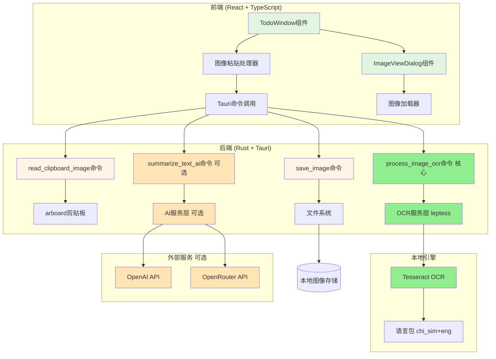
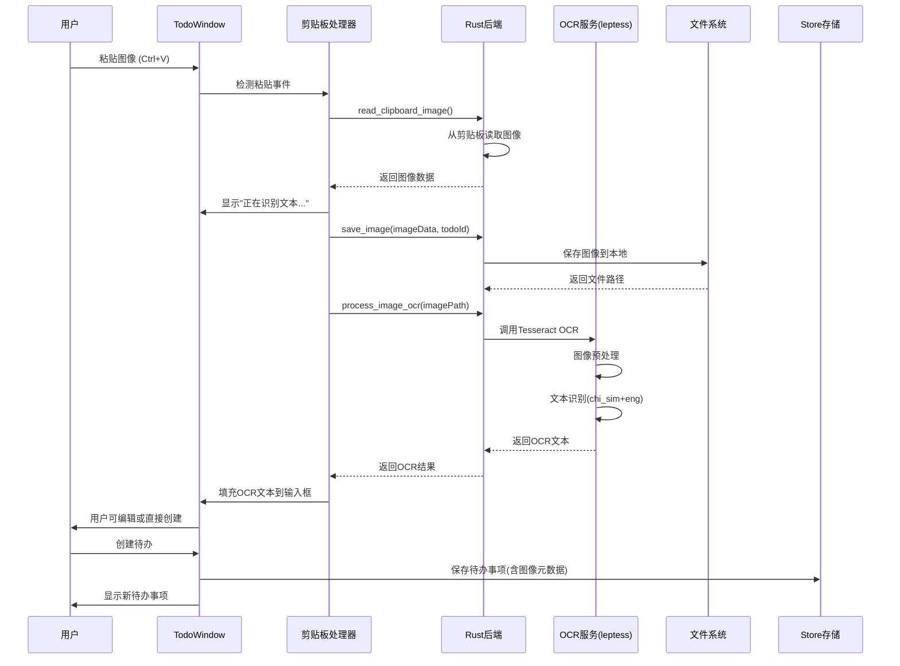
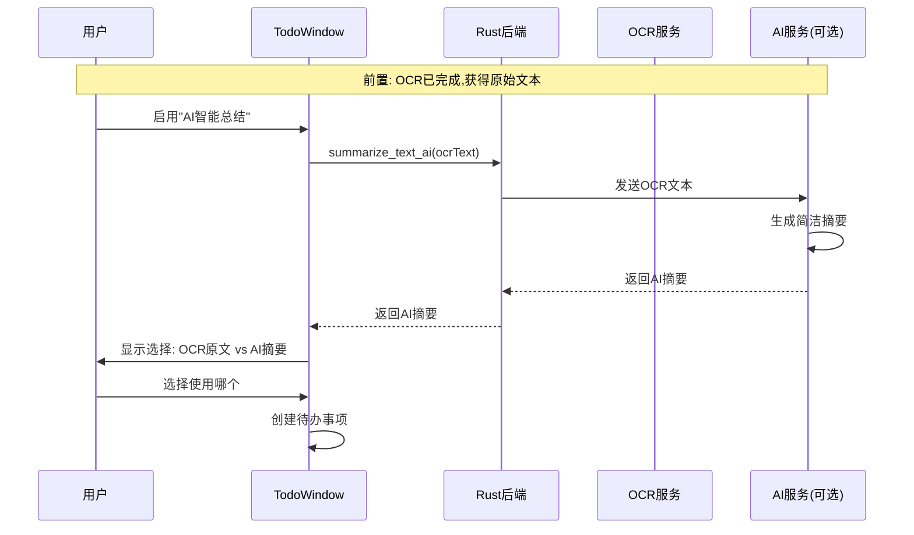

# AI图像识别待办事项 - 设计规格说明 (v3.0)

## 📋 版本更新说明

**v3.0 (2025-01-03) - OCR优先架构**:
- ✅ **核心变更**: 本地OCR(Tesseract/leptess)作为主要识别方式
- ✅ **AI降级**: AI从必需功能降级为可选增强功能
- ✅ **流程优化**: 图像 → OCR → (可选)AI总结
- ✅ **隐私优先**: 默认完全本地处理,无需网络
- ✅ **成本优化**: 基础功能免费,AI按需使用

**v2.0**: 多AI提供商支持(OpenAI, OpenRouter, Ollama, DeepSeek)
**v1.0**: 初始设计,完全依赖AI

## 概述

本文档详细描述了图像识别功能的技术设计,包括架构设计、数据流、组件设计和实现细节。设计基于现有的Tauri + React + TypeScript技术栈,采用**OCR优先、AI可选**的架构。

## 架构设计

### 系统架构图



### 数据流设计

#### 基础OCR流程(默认)


#### AI增强流程(可选)


## 组件设计

### 1. 前端组件

#### 1.1 TodoWindow组件扩展

**文件**: `src/components/todo-window.tsx`

**新增状态**:
```typescript
const [isProcessingImage, setIsProcessingImage] = useState(false)
const [imageProcessingProgress, setImageProcessingProgress] = useState<string>('')
```

**新增处理函数**:
```typescript
// 处理粘贴事件
const handlePaste = async (e: React.ClipboardEvent<HTMLInputElement>) => {
  const items = e.clipboardData?.items
  if (!items) return
  
  // 检查是否有图像
  for (let i = 0; i < items.length; i++) {
    if (items[i].type.startsWith('image/')) {
      e.preventDefault()
      await handleImagePaste()
      return
    }
  }
}

// 处理图像粘贴
const handleImagePaste = async () => {
  try {
    setIsProcessingImage(true)
    setImageProcessingProgress(t.readingClipboard)
    
    // 1. 从剪贴板读取图像
    const imageData = await invoke<ImageData>('read_clipboard_image')
    
    // 2. 生成待办事项ID
    const todoId = Date.now().toString()
    
    setImageProcessingProgress(t.savingImage)
    
    // 3. 保存图像
    const imagePath = await invoke<string>('save_image', {
      imageData: imageData.bytes,
      width: imageData.width,
      height: imageData.height,
      todoId
    })
    
    setImageProcessingProgress(t.analyzingImage)
    
    // 4. AI处理图像
    const result = await invoke<ImageProcessingResult>('process_image_ai', {
      imagePath,
      locale
    })
    
    // 5. 创建待办事项
    const newTodo: Todo = {
      id: todoId,
      text: result.summary,
      completed: false,
      createdAt: Date.now(),
      hasImage: true,
      imagePath,
      imageProcessingMethod: result.method,
      originalImageText: result.rawText
    }
    
    setTodos([...todos, newTodo])
    toast.success(t.imageTodoCreated)
    
  } catch (error) {
    console.error('Image processing failed:', error)
    toast.error(t.imageProcessingFailed)
  } finally {
    setIsProcessingImage(false)
    setImageProcessingProgress('')
  }
}

// 处理待办事项点击
const handleTodoClick = (todo: Todo) => {
  if (todo.hasImage) {
    setSelectedImageTodo(todo)
    setIsImageDialogOpen(true)
  }
}
```

#### 1.2 ImageViewDialog组件 (新建)

**文件**: `src/components/image-view-dialog.tsx`

```typescript
import * as Dialog from "@radix-ui/react-dialog"
import { X, ZoomIn, ZoomOut } from "lucide-react"
import { Button } from "@/components/ui/button"
import { useState } from "react"
import { convertFileSrc } from '@tauri-apps/api/core'
import type { Todo } from "@/lib/types"

interface ImageViewDialogProps {
  open: boolean
  onOpenChange: (open: boolean) => void
  todo: Todo | null
  locale: Locale
}

export function ImageViewDialog({
  open,
  onOpenChange,
  todo,
  locale
}: ImageViewDialogProps) {
  const t = useTranslation(locale)
  const [zoom, setZoom] = useState(1)
  
  if (!todo || !todo.imagePath) return null
  
  // 转换文件路径为可访问的URL
  const imageUrl = convertFileSrc(todo.imagePath)
  
  return (
    <Dialog.Root open={open} onOpenChange={onOpenChange}>
      <Dialog.Portal>
        <Dialog.Overlay className="fixed inset-0 z-50 bg-black/80 backdrop-blur-sm" />
        <Dialog.Content className="fixed left-1/2 top-1/2 z-50 -translate-x-1/2 -translate-y-1/2 w-[90vw] h-[90vh] bg-card rounded-lg shadow-lg overflow-hidden">
          {/* 头部 */}
          <div className="flex items-center justify-between px-6 py-4 border-b border-border/50">
            <Dialog.Title className="text-lg font-semibold">
              {todo.text}
            </Dialog.Title>
            <div className="flex items-center gap-2">
              <Button
                variant="ghost"
                size="icon"
                onClick={() => setZoom(Math.max(0.5, zoom - 0.25))}
              >
                <ZoomOut className="h-4 w-4" />
              </Button>
              <span className="text-sm text-muted-foreground min-w-[4rem] text-center">
                {Math.round(zoom * 100)}%
              </span>
              <Button
                variant="ghost"
                size="icon"
                onClick={() => setZoom(Math.min(3, zoom + 0.25))}
              >
                <ZoomIn className="h-4 w-4" />
              </Button>
              <Dialog.Close asChild>
                <Button variant="ghost" size="icon">
                  <X className="h-4 w-4" />
                </Button>
              </Dialog.Close>
            </div>
          </div>
          
          {/* 图像显示区域 */}
          <div className="flex-1 overflow-auto p-6">
            <div className="flex justify-center items-center min-h-full">
              
            </div>
          </div>
          
          {/* 底部信息 */}
          <div className="px-6 py-4 border-t border-border/50 bg-muted/30">
            <div className="space-y-2 text-sm">
              <div>
                <span className="text-muted-foreground">{t.processingMethod}: </span>
                <span className="font-medium">
                  {todo.imageProcessingMethod === 'ai' ? t.aiSummary : t.ocrOnly}
                </span>
              </div>
              {todo.originalImageText && (
                <div>
                  <span className="text-muted-foreground">{t.extractedText}: </span>
                  <p className="mt-1 text-foreground">{todo.originalImageText}</p>
                </div>
              )}
            </div>
          </div>
        </Dialog.Content>
      </Dialog.Portal>
    </Dialog.Root>
  )
}
```

### 2. 后端Rust实现

#### 2.1 数据结构定义

**文件**: `src-tauri/src/lib.rs`

```rust
use serde::{Serialize, Deserialize};
use std::path::PathBuf;

/// 图像数据结构
#[derive(Debug, Serialize, Deserialize)]
struct ImageData {
    width: usize,
    height: usize,
    bytes: Vec<u8>,
}

/// 图像处理结果
#[derive(Debug, Serialize, Deserialize)]
struct ImageProcessingResult {
    success: bool,
    summary: Option<String>,
    raw_text: Option<String>,
    method: String, // "ai" or "ocr"
    error: Option<String>,
}

/// AI服务配置
#[derive(Debug, Serialize, Deserialize)]
struct AIConfig {
    api_key: String,
    provider: String, // "openai" or "claude"
    model: String,
    timeout_seconds: u64,
}
```

#### 2.2 剪贴板图像读取

**文件**: `src-tauri/src/lib.rs`

```rust
use arboard::{Clipboard, ImageData as ArboardImageData};

/// 从剪贴板读取图像
#[tauri::command]
fn read_clipboard_image() -> Result<ImageData, String> {
    let mut clipboard = Clipboard::new()
        .map_err(|e| format!("无法访问剪贴板: {}", e))?;
    
    let image = clipboard
        .get_image()
        .map_err(|e| format!("剪贴板中没有图像: {}", e))?;
    
    Ok(ImageData {
        width: image.width,
        height: image.height,
        bytes: image.bytes.to_vec(),
    })
}
```

#### 2.3 图像保存

**文件**: `src-tauri/src/lib.rs`

```rust
use image::{RgbaImage, ImageBuffer};
use std::fs;

/// 保存图像到本地
#[tauri::command]
fn save_image(
    app: tauri::AppHandle,
    image_data: Vec<u8>,
    width: u32,
    height: u32,
    todo_id: String,
) -> Result<String, String> {
    // 获取应用数据目录
    let app_data_dir = app.path()
        .app_data_dir()
        .map_err(|e| format!("无法获取应用数据目录: {}", e))?;
    
    // 创建images子目录
    let images_dir = app_data_dir.join("images");
    fs::create_dir_all(&images_dir)
        .map_err(|e| format!("无法创建图像目录: {}", e))?;
    
    // 生成文件名
    let timestamp = chrono::Local::now().format("%Y%m%d_%H%M%S").to_string();
    let filename = format!("{}_{}.png", todo_id, timestamp);
    let file_path = images_dir.join(&filename);
    
    // 将字节数据转换为图像
    let img = RgbaImage::from_raw(width, height, image_data)
        .ok_or("无效的图像数据")?;
    
    // 保存图像
    img.save(&file_path)
        .map_err(|e| format!("保存图像失败: {}", e))?;
    
    Ok(file_path.to_string_lossy().to_string())
}
```

#### 2.4 OCR服务模块 (核心功能) ⭐

**推荐方案**: 使用**leptess** (Tesseract Rust绑定)

**为什么选择leptess?**
- ✅ 成熟稳定: Tesseract是业界标准OCR引擎
- ✅ 完全本地: 无需网络,保护隐私
- ✅ 多语言支持: 支持100+语言
- ✅ 免费开源: 无使用成本
- ✅ Rust绑定: leptess提供安全的Rust API

**文件**: `src-tauri/src/ocr_service.rs` (新建)

```rust
use leptess::{LepTess, Variable};
use std::path::Path;
use serde::{Serialize, Deserialize};

#[derive(Debug, Serialize, Deserialize)]
pub struct OcrResult {
    pub text: String,
    pub confidence: f32,
    pub language: String,
}

/// OCR服务
pub struct OcrService {
    tesseract: LepTess,
}

impl OcrService {
    /// 创建OCR服务实例
    pub fn new() -> Result<Self, String> {
        // 初始化Tesseract,支持中英文
        let mut tesseract = LepTess::new(None, "chi_sim+eng")
            .map_err(|e| format!("Tesseract初始化失败: {}. 请确保已安装Tesseract和语言包", e))?;

        // 设置OCR参数
        tesseract.set_variable(Variable::TesseditPagesegMode, "3")
            .map_err(|e| format!("设置OCR参数失败: {}", e))?;

        Ok(Self { tesseract })
    }

    /// 从图像文件识别文本
    pub fn recognize_from_file(&mut self, image_path: &str) -> Result<OcrResult, String> {
        // 加载图像
        self.tesseract.set_image(image_path)
            .map_err(|e| format!("加载图像失败: {}", e))?;

        // 执行OCR
        let text = self.tesseract.get_utf8_text()
            .map_err(|e| format!("OCR识别失败: {}", e))?;

        // 获取置信度
        let confidence = self.tesseract.mean_text_conf() as f32;

        Ok(OcrResult {
            text: text.trim().to_string(),
            confidence,
            language: "chi_sim+eng".to_string(),
        })
    }
}

/// Tauri命令: 处理图像OCR
#[tauri::command]
pub async fn process_image_ocr(image_path: String) -> Result<OcrResult, String> {
    // 验证文件存在
    if !Path::new(&image_path).exists() {
        return Err("图像文件不存在".to_string());
    }

    // 创建OCR服务
    let mut ocr = OcrService::new()?;

    // 执行OCR
    let result = ocr.recognize_from_file(&image_path)?;

    // 检查是否识别到文本
    if result.text.is_empty() {
        return Err("未识别到文本内容".to_string());
    }

    Ok(result)
}
```

**依赖项** (`src-tauri/Cargo.toml`):
```toml
[dependencies]
leptess = "0.14"  # Tesseract Rust绑定
```

**系统依赖**:
- **macOS**: `brew install tesseract tesseract-lang`
- **Ubuntu/Debian**: `sudo apt-get install tesseract-ocr tesseract-ocr-chi-sim tesseract-ocr-eng`
- **Windows**: 下载安装 [Tesseract-OCR](https://github.com/UB-Mannheim/tesseract/wiki)

#### 2.5 AI文本总结服务 (可选增强功能)

**用途**: 对OCR提取的文本进行智能总结,生成更简洁的待办事项描述

**推荐方案**: 使用**OpenAI兼容API**标准,支持多个AI提供商

**支持的AI提供商** (2025年):
1. **OpenAI** - GPT-4 (文本模型,不是Vision)
2. **Anthropic Claude** - Claude 3.5 Sonnet (通过OpenRouter)
3. **OpenRouter** - 统一网关,支持100+模型
4. **本地模型** - Ollama + Llama/Qwen (离线)

**注意**:
- ⚠️ 此功能是**可选的**,默认关闭
- ⚠️ 输入是OCR文本,不是图像(无需Vision模型)
- ⚠️ 用户需要明确启用并配置API密钥

**架构优势**:
- 统一的OpenAI格式API接口
- 一套代码支持多个提供商
- 轻松切换和A/B测试
- 降低供应商锁定风险

**文件**: `src-tauri/src/ai_service.rs` (修改)

```rust
use serde::{Serialize, Deserialize};
use std::path::Path;
use std::fs;
use base64::{Engine as _, engine::general_purpose};

#[derive(Debug, Serialize, Deserialize)]
pub struct ProcessingResult {
    pub summary: String,
    pub raw_text: String,
    pub method: String,
    pub provider: String,
    pub model: String,
}

/// AI提供商配置
#[derive(Debug, Clone, Serialize, Deserialize)]
pub struct AIProvider {
    pub name: String,          // "openai", "openrouter", "ollama"
    pub api_base: String,      // API基础URL
    pub api_key: Option<String>,
    pub model: String,         // 模型名称
    pub enabled: bool,
}

impl AIProvider {
    /// OpenAI官方
    pub fn openai(api_key: String) -> Self {
        Self {
            name: "openai".to_string(),
            api_base: "https://api.openai.com/v1".to_string(),
            api_key: Some(api_key),
            model: "gpt-4.1".to_string(),
            enabled: true,
        }
    }

    /// OpenRouter (支持多个模型)
    pub fn openrouter(api_key: String, model: Option<String>) -> Self {
        Self {
            name: "openrouter".to_string(),
            api_base: "https://openrouter.ai/api/v1".to_string(),
            api_key: Some(api_key),
            model: model.unwrap_or("anthropic/claude-3.5-sonnet".to_string()),
            enabled: true,
        }
    }

    /// Ollama本地模型
    pub fn ollama(model: Option<String>) -> Self {
        Self {
            name: "ollama".to_string(),
            api_base: "http://localhost:11434/v1".to_string(),
            api_key: None,
            model: model.unwrap_or("llava".to_string()),
            enabled: true,
        }
    }
}

/// OpenAI兼容API请求结构
#[derive(Debug, Serialize)]
struct OpenAICompatibleRequest {
    model: String,
    messages: Vec<OpenAIMessage>,
    max_tokens: u32,
    temperature: f32,
}

#[derive(Debug, Serialize)]
struct OpenAIMessage {
    role: String,
    content: Vec<OpenAIContent>,
}

#[derive(Debug, Serialize)]
#[serde(tag = "type")]
enum OpenAIContent {
    #[serde(rename = "text")]
    Text { text: String },
    #[serde(rename = "image_url")]
    ImageUrl { image_url: ImageUrl },
}

#[derive(Debug, Serialize)]
struct ImageUrl {
    url: String,
}

#[derive(Debug, Deserialize)]
struct OpenAIResponse {
    choices: Vec<OpenAIChoice>,
}

#[derive(Debug, Deserialize)]
struct OpenAIChoice {
    message: OpenAIResponseMessage,
}

#[derive(Debug, Deserialize)]
struct OpenAIResponseMessage {
    content: String,
}

/// 使用OpenAI兼容API处理图像 (支持多提供商)
pub async fn process_with_ai_provider(
    image_path: &str,
    provider: &AIProvider,
    locale: &str,
) -> Result<ProcessingResult, String> {
    // 读取图像文件
    let image_bytes = fs::read(image_path)
        .map_err(|e| format!("读取图像失败: {}", e))?;

    // 转换为base64
    let base64_image = general_purpose::STANDARD.encode(&image_bytes);
    let data_url = format!("data:image/png;base64,{}", base64_image);

    // 构建提示词
    let prompt = if locale == "zh-CN" {
        "请分析这张图片,提取其中的文本内容,并用1-2句话总结图片的主要内容。\
         请按以下格式返回:\n\
         提取的文本: [这里是OCR提取的所有文本]\n\
         摘要: [这里是1-2句话的摘要]"
    } else {
        "Please analyze this image, extract the text content, and summarize the main content in 1-2 sentences.\
         Please return in the following format:\n\
         Extracted text: [All OCR extracted text here]\n\
         Summary: [1-2 sentence summary here]"
    };

    // 构建OpenAI兼容请求
    let request = OpenAICompatibleRequest {
        model: provider.model.clone(),
        messages: vec![OpenAIMessage {
            role: "user".to_string(),
            content: vec![
                OpenAIContent::Text {
                    text: prompt.to_string(),
                },
                OpenAIContent::ImageUrl {
                    image_url: ImageUrl {
                        url: data_url,
                    },
                },
            ],
        }],
        max_tokens: 500,
        temperature: 0.3,
    };

    // 构建API URL
    let api_url = format!("{}/chat/completions", provider.api_base);

    // 发送请求
    let client = reqwest::Client::new();
    let mut request_builder = client
        .post(&api_url)
        .header("Content-Type", "application/json")
        .json(&request)
        .timeout(std::time::Duration::from_secs(30));

    // 添加认证头(如果需要)
    if let Some(api_key) = &provider.api_key {
        request_builder = request_builder.header("Authorization", format!("Bearer {}", api_key));
    }

    // OpenRouter需要额外的头
    if provider.name == "openrouter" {
        request_builder = request_builder
            .header("HTTP-Referer", "https://imagetodo.app")
            .header("X-Title", "ImageTodo");
    }

    let response = request_builder
        .send()
        .await
        .map_err(|e| format!("API请求失败 ({}): {}", provider.name, e))?;

    if !response.status().is_success() {
        let status = response.status();
        let error_text = response.text().await.unwrap_or_default();
        return Err(format!("API返回错误 {} ({}): {}", status, provider.name, error_text));
    }

    let api_response: OpenAIResponse = response
        .json()
        .await
        .map_err(|e| format!("解析响应失败 ({}): {}", provider.name, e))?;

    // 解析响应
    let content = api_response.choices
        .first()
        .ok_or(format!("API响应为空 ({})", provider.name))?
        .message
        .content
        .clone();

    // 解析提取的文本和摘要
    let (raw_text, summary) = parse_ai_response(&content, locale);

    Ok(ProcessingResult {
        summary,
        raw_text,
        method: "ai".to_string(),
        provider: provider.name.clone(),
        model: provider.model.clone(),
    })
}

/// 智能选择最佳提供商
pub async fn process_with_best_provider(
    image_path: &str,
    providers: Vec<AIProvider>,
    locale: &str,
) -> Result<ProcessingResult, String> {
    let mut last_error = String::new();

    // 按优先级尝试每个提供商
    for provider in providers.iter().filter(|p| p.enabled) {
        match process_with_ai_provider(image_path, provider, locale).await {
            Ok(result) => return Ok(result),
            Err(e) => {
                eprintln!("提供商 {} 失败: {}", provider.name, e);
                last_error = e;
                // 继续尝试下一个提供商
            }
        }
    }

    Err(format!("所有AI提供商都失败了。最后错误: {}", last_error))
}

/// 解析AI响应
fn parse_ai_response(content: &str, locale: &str) -> (String, String) {
    let (text_marker, summary_marker) = if locale == "zh-CN" {
        ("提取的文本:", "摘要:")
    } else {
        ("Extracted text:", "Summary:")
    };

    let mut raw_text = String::new();
    let mut summary = String::new();

    if let Some(text_start) = content.find(text_marker) {
        let text_content = &content[text_start + text_marker.len()..];
        if let Some(summary_start) = text_content.find(summary_marker) {
            raw_text = text_content[..summary_start].trim().to_string();
            summary = text_content[summary_start + summary_marker.len()..].trim().to_string();
        } else {
            raw_text = text_content.trim().to_string();
        }
    }

    // 如果解析失败,使用整个内容作为摘要
    if summary.is_empty() {
        summary = content.trim().to_string();
    }

    (raw_text, summary)
}

/// AI文本总结 (可选功能)
/// 输入: OCR提取的文本
/// 输出: AI生成的简洁摘要
pub async fn summarize_text_with_ai(
    text: &str,
    provider: &AIProvider,
    locale: &str,
) -> Result<String, String> {
    // 构建提示词
    let prompt = if locale == "zh-CN" {
        format!("请将以下文本总结成1-2句话的待办事项描述:\n\n{}", text)
    } else {
        format!("Please summarize the following text into a 1-2 sentence todo item description:\n\n{}", text)
    };

    // 构建OpenAI兼容请求(纯文本,无需Vision)
    let request = OpenAICompatibleRequest {
        model: provider.model.clone(),
        messages: vec![OpenAIMessage {
            role: "user".to_string(),
            content: vec![OpenAIContent::Text {
                text: prompt,
            }],
        }],
        max_tokens: 200,
        temperature: 0.3,
    };

    // 构建API URL
    let api_url = format!("{}/chat/completions", provider.api_base);

    // 发送请求
    let client = reqwest::Client::new();
    let mut request_builder = client
        .post(&api_url)
        .header("Content-Type", "application/json")
        .json(&request)
        .timeout(std::time::Duration::from_secs(10));

    // 添加认证头
    if let Some(api_key) = &provider.api_key {
        request_builder = request_builder.header("Authorization", format!("Bearer {}", api_key));
    }

    // OpenRouter额外头
    if provider.name == "openrouter" {
        request_builder = request_builder
            .header("HTTP-Referer", "https://imagetodo.app")
            .header("X-Title", "ImageTodo");
    }

    let response = request_builder
        .send()
        .await
        .map_err(|e| format!("AI总结请求失败: {}", e))?;

    if !response.status().is_success() {
        return Err(format!("AI总结失败: {}", response.status()));
    }

    let api_response: OpenAIResponse = response
        .json()
        .await
        .map_err(|e| format!("解析AI响应失败: {}", e))?;

    let summary = api_response.choices
        .first()
        .ok_or("AI响应为空")?
        .message
        .content
        .trim()
        .to_string();

    Ok(summary)
}

/// Tauri命令: AI文本总结
#[tauri::command]
pub async fn summarize_text_ai(
    text: String,
    api_key: String,
    provider_name: Option<String>,
    locale: String,
) -> Result<String, String> {
    let provider = match provider_name.as_deref() {
        Some("openrouter") => AIProvider::openrouter(api_key, None),
        _ => AIProvider::openai(api_key),
    };

    summarize_text_with_ai(&text, &provider, &locale).await
}
```

#### 2.5 主处理命令 - 多提供商支持

**文件**: `src-tauri/src/lib.rs`

```rust
mod ai_service;

use ai_service::{AIProvider, process_with_best_provider, process_with_local_ocr};

/// 从设置加载AI提供商配置
fn load_ai_providers(app: &tauri::AppHandle) -> Vec<AIProvider> {
    let mut providers = Vec::new();

    let store = match app.store("settings.json") {
        Ok(s) => s,
        Err(_) => return providers,
    };

    let settings = match store.get("settings") {
        Some(s) => s,
        None => return providers,
    };

    // OpenAI
    if let Some(openai_key) = settings.get("openaiApiKey").and_then(|v| v.as_str()) {
        if !openai_key.is_empty() {
            providers.push(AIProvider::openai(openai_key.to_string()));
        }
    }

    // OpenRouter (支持Claude, Gemini等)
    if let Some(openrouter_key) = settings.get("openrouterApiKey").and_then(|v| v.as_str()) {
        if !openrouter_key.is_empty() {
            let model = settings.get("openrouterModel")
                .and_then(|v| v.as_str())
                .map(|s| s.to_string());
            providers.push(AIProvider::openrouter(openrouter_key.to_string(), model));
        }
    }

    // Ollama本地模型
    if let Some(use_ollama) = settings.get("useOllama").and_then(|v| v.as_bool()) {
        if use_ollama {
            let model = settings.get("ollamaModel")
                .and_then(|v| v.as_str())
                .map(|s| s.to_string());
            providers.push(AIProvider::ollama(model));
        }
    }

    providers
}

/// 处理图像(AI识别) - 支持多提供商
#[tauri::command]
async fn process_image_ai(
    app: tauri::AppHandle,
    image_path: String,
    locale: String,
) -> Result<ImageProcessingResult, String> {
    // 加载所有配置的AI提供商
    let providers = load_ai_providers(&app);

    if providers.is_empty() {
        eprintln!("未配置AI提供商,使用本地OCR");
    } else {
        // 尝试使用AI提供商
        match process_with_best_provider(&image_path, providers, &locale).await {
            Ok(result) => {
                return Ok(ImageProcessingResult {
                    success: true,
                    summary: Some(result.summary),
                    raw_text: Some(result.raw_text),
                    method: result.method,
                    provider: Some(result.provider),
                    model: Some(result.model),
                    error: None,
                });
            }
            Err(e) => {
                eprintln!("所有AI提供商失败,回退到本地OCR: {}", e);
                // 继续尝试本地OCR
            }
        }
    }

    // 使用本地OCR作为最终后备
    match process_with_local_ocr(&image_path) {
        Ok(result) => {
            Ok(ImageProcessingResult {
                success: true,
                summary: Some(result.summary),
                raw_text: Some(result.raw_text),
                method: result.method,
                provider: Some(result.provider),
                model: Some(result.model),
                error: None,
            })
        }
        Err(e) => {
            Ok(ImageProcessingResult {
                success: false,
                summary: None,
                raw_text: None,
                method: "none".to_string(),
                provider: None,
                model: None,
                error: Some(e),
            })
        }
    }
}

/// 获取可用的AI提供商列表
#[tauri::command]
fn get_available_providers(app: tauri::AppHandle) -> Vec<String> {
    load_ai_providers(&app)
        .iter()
        .filter(|p| p.enabled)
        .map(|p| format!("{} ({})", p.name, p.model))
        .collect()
}

/// 清理待办事项关联的图像
#[tauri::command]
fn cleanup_todo_image(
    app: tauri::AppHandle,
    image_path: String,
) -> Result<(), String> {
    let path = Path::new(&image_path);
    if path.exists() {
        fs::remove_file(path)
            .map_err(|e| format!("删除图像失败: {}", e))?;
    }
    Ok(())
}
```

### 3. 数据模型扩展

#### 3.1 Todo接口扩展

**文件**: `src/lib/types.ts`

```typescript
export interface Todo {
  id: string
  text: string
  completed: boolean
  createdAt: number
  // 新增字段
  hasImage?: boolean
  imagePath?: string
  imageProcessingMethod?: 'ocr' | 'ai'
  originalImageText?: string
}
```

#### 3.2 设置接口扩展 - 多提供商支持

**文件**: `src/lib/settings.ts`

```typescript
export interface AppSettings {
  locale: Locale
  regionCaptureShortcut: string

  // AI提供商配置
  // OpenAI
  openaiApiKey?: string

  // OpenRouter (支持Claude, Gemini, 等100+模型)
  openrouterApiKey?: string
  openrouterModel?: string  // 例如: "anthropic/claude-3.5-sonnet", "google/gemini-pro-vision"

  // Ollama本地模型
  useOllama?: boolean
  ollamaModel?: string      // 例如: "llava", "bakllava"

  // 处理模式
  imageProcessingMode?: 'ocr' | 'ai' | 'auto'

  // 提供商优先级
  providerPriority?: string[]  // 例如: ["openai", "openrouter", "ollama"]
}

export const defaultSettings: AppSettings = {
  locale: 'zh-CN',
  regionCaptureShortcut: 'Alt+Shift+P',
  imageProcessingMode: 'auto',
  openrouterModel: 'anthropic/claude-3.5-sonnet',
  ollamaModel: 'llava',
  useOllama: false,
  providerPriority: ['openai', 'openrouter', 'ollama']
}
```

**支持的OpenRouter模型示例**:
```typescript
export const OPENROUTER_MODELS = [
  { id: 'anthropic/claude-3.5-sonnet', name: 'Claude 3.5 Sonnet', vision: true },
  { id: 'openai/gpt-4.1', name: 'GPT-4.1', vision: true },
  { id: 'google/gemini-pro-vision', name: 'Gemini Pro Vision', vision: true },
  { id: 'meta-llama/llama-3.2-90b-vision', name: 'Llama 3.2 Vision', vision: true },
]
```

### 4. 国际化文本

#### 4.1 中文翻译

**文件**: `src/lib/i18n.ts`

```typescript
export const translations = {
  "zh-CN": {
    // ... 现有翻译 ...

    // 图像处理相关
    readingClipboard: "正在读取剪贴板...",
    savingImage: "正在保存图像...",
    analyzingImage: "正在分析图像...",
    imageTodoCreated: "已从图像创建待办事项",
    imageProcessingFailed: "图像处理失败",
    noImageInClipboard: "剪贴板中没有图像",

    // 图像查看对话框
    processingMethod: "处理方式",
    aiSummary: "AI摘要",
    ocrOnly: "仅OCR",
    extractedText: "提取的文本",

    // 设置 - AI提供商
    aiProviders: "AI提供商",
    openaiApiKey: "OpenAI API密钥",
    openrouterApiKey: "OpenRouter API密钥",
    openrouterModel: "OpenRouter模型",
    useOllama: "使用Ollama本地模型",
    ollamaModel: "Ollama模型",
    imageProcessingMode: "图像处理模式",
    processingModeAuto: "自动",
    processingModeAI: "AI摘要",
    processingModeOCR: "仅OCR",
    providerPriority: "提供商优先级",
    testProvider: "测试连接",
    providerConnected: "连接成功",
    providerFailed: "连接失败",
  },

  "en": {
    // ... 现有翻译 ...

    // Image processing
    readingClipboard: "Reading clipboard...",
    savingImage: "Saving image...",
    analyzingImage: "Analyzing image...",
    imageTodoCreated: "Todo created from image",
    imageProcessingFailed: "Image processing failed",
    noImageInClipboard: "No image in clipboard",

    // Image view dialog
    processingMethod: "Processing Method",
    aiSummary: "AI Summary",
    ocrOnly: "OCR Only",
    extractedText: "Extracted Text",

    // Settings - AI Providers
    aiProviders: "AI Providers",
    openaiApiKey: "OpenAI API Key",
    openrouterApiKey: "OpenRouter API Key",
    openrouterModel: "OpenRouter Model",
    useOllama: "Use Ollama Local Model",
    ollamaModel: "Ollama Model",
    imageProcessingMode: "Image Processing Mode",
    processingModeAuto: "Auto",
    processingModeAI: "AI Summary",
    processingModeOCR: "OCR Only",
    providerPriority: "Provider Priority",
    testProvider: "Test Connection",
    providerConnected: "Connected Successfully",
    providerFailed: "Connection Failed",
  }
}
```

### 5. 多AI提供商方案详解

#### 5.1 为什么选择OpenAI兼容API标准?

**优势**:
1. **统一接口**: 一套代码支持多个提供商
2. **零供应商锁定**: 轻松切换提供商
3. **成本优化**: 根据价格和性能选择最佳提供商
4. **高可用性**: 自动故障转移
5. **本地优先**: 支持完全离线的Ollama

**支持的提供商对比** (2025年):

| 提供商 | 优势 | 价格 | 速度 | 准确度 | 离线 |
|--------|------|------|------|--------|------|
| **OpenAI GPT-4.1** | 官方,最新模型 | $$$ | 快 | 极高 | ❌ |
| **OpenRouter** | 100+模型,统一接口 | $ - $$$ | 中-快 | 高 | ❌ |
| **Claude 3.5** (via OpenRouter) | 文档理解强 | $$ | 快 | 极高 | ❌ |
| **Gemini Pro** (via OpenRouter) | Google,免费额度 | $ | 快 | 高 | ❌ |
| **Ollama + LLaVA** | 完全免费,隐私 | 免费 | 中 | 中 | ✅ |

#### 5.2 OpenRouter的优势

**OpenRouter** (https://openrouter.ai) 是一个AI模型网关,提供:

1. **统一API**: 一个API密钥访问100+模型
2. **自动路由**: 根据可用性和成本自动选择
3. **透明定价**: 按使用付费,无月费
4. **模型多样性**:
   - Anthropic Claude系列
   - Google Gemini系列
   - Meta Llama系列
   - OpenAI GPT系列
   - 开源模型

**示例配置**:
```typescript
// 用户可以在设置中选择喜欢的模型
const openrouterModels = [
  'anthropic/claude-3.5-sonnet',      // 最佳文档理解
  'google/gemini-pro-vision',         // 性价比高
  'openai/gpt-4.1',                   // 最新OpenAI
  'meta-llama/llama-3.2-90b-vision',  // 开源替代
]
```

#### 5.3 Ollama本地方案

**Ollama** (https://ollama.ai) 提供完全离线的AI能力:

**优势**:
- ✅ 完全免费
- ✅ 数据隐私(不上传到云端)
- ✅ 无网络依赖
- ✅ 无API密钥需求

**支持的视觉模型**:
- `llava` - 7B参数,快速
- `llava:13b` - 13B参数,更准确
- `bakllava` - 专门优化的视觉模型

**安装**:
```bash
# macOS/Linux
curl -fsSL https://ollama.ai/install.sh | sh

# 下载视觉模型
ollama pull llava
```

**使用**:
```rust
// Ollama使用OpenAI兼容API
let provider = AIProvider::ollama(Some("llava".to_string()));
```

### 6. 依赖项管理

#### 6.1 Rust依赖

**文件**: `src-tauri/Cargo.toml`

```toml
[dependencies]
# ... 现有依赖 ...

# 新增依赖
reqwest = { version = "0.11", features = ["json"] }
tokio = { version = "1", features = ["full"] }
base64 = "0.21"

# 可选: 本地OCR支持
# leptess = "0.13"  # Tesseract OCR绑定
```

#### 6.2 前端依赖

**文件**: `package.json`

无需新增依赖,使用现有的:
- `@tauri-apps/api` - Tauri API调用
- `@radix-ui/react-dialog` - 图像查看对话框
- `lucide-react` - 图标

### 7. 设置界面扩展 - AI提供商配置

**文件**: `src/components/ai-provider-settings.tsx` (新建)

```typescript
import { useState } from 'react'
import { Button } from '@/components/ui/button'
import { Input } from '@/components/ui/input'
import { Select } from '@/components/ui/select'
import { Switch } from '@/components/ui/switch'
import { invoke } from '@tauri-apps/api/core'
import { toast } from 'sonner'
import { useTranslation } from '@/lib/i18n'

export function AIProviderSettings({ settings, onSettingsChange }) {
  const t = useTranslation()
  const [testing, setTesting] = useState(false)

  const testProvider = async (provider: string) => {
    setTesting(true)
    try {
      const available = await invoke('get_available_providers')
      if (available.includes(provider)) {
        toast.success(t.providerConnected)
      } else {
        toast.error(t.providerFailed)
      }
    } catch (error) {
      toast.error(t.providerFailed)
    } finally {
      setTesting(false)
    }
  }

  return (
    <div className="space-y-6">
      <h3 className="text-lg font-semibold">{t.aiProviders}</h3>

      {/* OpenAI */}
      <div className="space-y-2">
        <label className="text-sm font-medium">OpenAI</label>
        <div className="flex gap-2">
          <Input
            type="password"
            placeholder={t.openaiApiKey}
            value={settings.openaiApiKey || ''}
            onChange={(e) => onSettingsChange({ openaiApiKey: e.target.value })}
          />
          <Button
            variant="outline"
            onClick={() => testProvider('openai')}
            disabled={testing || !settings.openaiApiKey}
          >
            {t.testProvider}
          </Button>
        </div>
      </div>

      {/* OpenRouter */}
      <div className="space-y-2">
        <label className="text-sm font-medium">OpenRouter</label>
        <Input
          type="password"
          placeholder={t.openrouterApiKey}
          value={settings.openrouterApiKey || ''}
          onChange={(e) => onSettingsChange({ openrouterApiKey: e.target.value })}
        />
        <Select
          value={settings.openrouterModel}
          onValueChange={(value) => onSettingsChange({ openrouterModel: value })}
        >
          <option value="anthropic/claude-3.5-sonnet">Claude 3.5 Sonnet</option>
          <option value="google/gemini-pro-vision">Gemini Pro Vision</option>
          <option value="openai/gpt-4.1">GPT-4.1</option>
          <option value="meta-llama/llama-3.2-90b-vision">Llama 3.2 Vision</option>
        </Select>
      </div>

      {/* Ollama */}
      <div className="space-y-2">
        <div className="flex items-center justify-between">
          <label className="text-sm font-medium">Ollama (本地)</label>
          <Switch
            checked={settings.useOllama || false}
            onCheckedChange={(checked) => onSettingsChange({ useOllama: checked })}
          />
        </div>
        {settings.useOllama && (
          <Select
            value={settings.ollamaModel}
            onValueChange={(value) => onSettingsChange({ ollamaModel: value })}
          >
            <option value="llava">LLaVA (7B)</option>
            <option value="llava:13b">LLaVA (13B)</option>
            <option value="bakllava">BakLLaVA</option>
          </Select>
        )}
      </div>

      {/* 处理模式 */}
      <div className="space-y-2">
        <label className="text-sm font-medium">{t.imageProcessingMode}</label>
        <Select
          value={settings.imageProcessingMode}
          onValueChange={(value) => onSettingsChange({ imageProcessingMode: value })}
        >
          <option value="auto">{t.processingModeAuto}</option>
          <option value="ai">{t.processingModeAI}</option>
          <option value="ocr">{t.processingModeOCR}</option>
        </Select>
      </div>
    </div>
  )
}
```

### 8. 文件系统结构

```
ImageTodo/
├── src/
│   ├── components/
│   │   ├── todo-window.tsx (修改)
│   │   ├── image-view-dialog.tsx (新建)
│   │   ├── ai-provider-settings.tsx (新建)
│   │   └── settings-popup.tsx (修改)
│   ├── lib/
│   │   ├── types.ts (修改)
│   │   ├── settings.ts (修改)
│   │   ├── i18n.ts (修改)
│   │   └── ai-models.ts (新建 - OpenRouter模型列表)
│   └── ...
├── src-tauri/
│   ├── src/
│   │   ├── lib.rs (修改)
│   │   └── ai_service.rs (新建 - 多提供商支持)
│   ├── Cargo.toml (修改)
│   └── ...
└── ...

运行时数据目录:
{app_data}/
└── images/
    ├── {todo_id_1}_{timestamp}.png
    ├── {todo_id_2}_{timestamp}.png
    └── ...
```

### 9. 错误处理策略

#### 9.1 前端错误处理

```typescript
// 剪贴板读取失败
try {
  const imageData = await invoke('read_clipboard_image')
} catch (error) {
  if (error.includes('没有图像')) {
    toast.error(t.noImageInClipboard)
  } else {
    toast.error(t.clipboardAccessFailed)
  }
  return
}

// AI处理失败
try {
  const result = await invoke('process_image_ai', { imagePath, locale })
  if (!result.success) {
    // 允许用户手动编辑
    const manualText = prompt(t.aiFailedEnterManually)
    if (manualText) {
      // 使用手动输入的文本创建待办事项
    }
  }
} catch (error) {
  // 显示错误并提供手动输入选项
}
```

#### 9.2 后端错误处理 - 多提供商故障转移

```rust
// API调用超时
let response = client
    .post(url)
    .timeout(Duration::from_secs(30))
    .send()
    .await
    .map_err(|e| {
        if e.is_timeout() {
            "API请求超时,请检查网络连接".to_string()
        } else {
            format!("网络错误: {}", e)
        }
    })?;

// API密钥无效
if response.status() == 401 {
    return Err("API密钥无效,请在设置中检查".to_string());
}

// 速率限制
if response.status() == 429 {
    return Err("API请求过于频繁,请稍后再试".to_string());
}
```

### 10. 性能优化

#### 10.1 图像压缩

```rust
use image::imageops::FilterType;

fn compress_image_if_needed(img: &RgbaImage) -> RgbaImage {
    let max_dimension = 2048;
    let (width, height) = img.dimensions();

    if width > max_dimension || height > max_dimension {
        let scale = max_dimension as f32 / width.max(height) as f32;
        let new_width = (width as f32 * scale) as u32;
        let new_height = (height as f32 * scale) as u32;

        image::imageops::resize(
            img,
            new_width,
            new_height,
            FilterType::Lanczos3
        )
    } else {
        img.clone()
    }
}
```

#### 10.2 延迟加载图像

```typescript
// 在TodoWindow中,只在需要时加载图像
const [loadedImages, setLoadedImages] = useState<Set<string>>(new Set())

const loadImageForTodo = (todoId: string) => {
  if (!loadedImages.has(todoId)) {
    setLoadedImages(prev => new Set(prev).add(todoId))
  }
}
```

#### 10.3 缓存AI结果

```rust
use std::collections::HashMap;
use std::sync::Mutex;

// 全局缓存
lazy_static! {
    static ref AI_CACHE: Mutex<HashMap<String, ProcessingResult>> =
        Mutex::new(HashMap::new());
}

fn get_cached_result(image_path: &str) -> Option<ProcessingResult> {
    let cache = AI_CACHE.lock().unwrap();
    cache.get(image_path).cloned()
}

fn cache_result(image_path: String, result: ProcessingResult) {
    let mut cache = AI_CACHE.lock().unwrap();
    cache.insert(image_path, result);
}
```

### 11. 安全考虑

#### 11.1 API密钥存储

```typescript
// 使用Tauri的安全存储
import { save } from '@tauri-apps/plugin-store'

async function saveApiKey(apiKey: string) {
  const store = await load('settings.json', { autoSave: true })
  // API密钥加密存储
  await store.set('openaiApiKey', apiKey)
  await store.save()
}
```

#### 11.2 图像路径验证

```rust
fn validate_image_path(path: &str, app_data_dir: &Path) -> Result<(), String> {
    let path = Path::new(path);

    // 确保路径在应用数据目录内
    if !path.starts_with(app_data_dir) {
        return Err("无效的图像路径".to_string());
    }

    // 确保是PNG文件
    if path.extension() != Some(std::ffi::OsStr::new("png")) {
        return Err("仅支持PNG格式".to_string());
    }

    Ok(())
}
```

### 12. 测试策略

#### 12.1 单元测试

```rust
#[cfg(test)]
mod tests {
    use super::*;

    #[test]
    fn test_parse_ai_response() {
        let content = "提取的文本: Hello World\n摘要: 这是一个测试";
        let (text, summary) = parse_ai_response(content, "zh-CN");
        assert_eq!(text, "Hello World");
        assert_eq!(summary, "这是一个测试");
    }

    #[tokio::test]
    async fn test_image_compression() {
        // 测试图像压缩逻辑
    }
}
```

#### 12.2 集成测试

```typescript
describe('Image Paste Handling', () => {
  it('should detect image paste event', async () => {
    // 模拟粘贴事件
    const event = new ClipboardEvent('paste', {
      clipboardData: new DataTransfer()
    })

    // 测试处理逻辑
  })

  it('should create todo from image', async () => {
    // 测试完整流程
  })
})
```

### 13. 命令注册

**文件**: `src-tauri/src/lib.rs`

```rust
#[cfg_attr(mobile, tauri::mobile_entry_point)]
pub fn run() {
    tauri::Builder::default()
        .plugin(tauri_plugin_store::Builder::new().build())
        .plugin(tauri_plugin_opener::init())
        .setup(|app| {
            // ... 现有设置 ...
            Ok(())
        })
        .invoke_handler(tauri::generate_handler![
            greet,
            capture_screen_region,
            // 新增命令
            read_clipboard_image,
            save_image,
            process_image_ai,
            cleanup_todo_image,
            get_available_providers,  // 新增
        ])
        .run(tauri::generate_context!())
        .expect("error while running tauri application");
}
```

## 实现优先级 (v3.0 - OCR优先架构)

### 阶段1: 核心OCR功能 (最高优先级) ⭐
1. **Tesseract安装和配置** - 系统依赖检查
2. **OCR服务模块** - leptess集成
3. **剪贴板图像读取** - arboard
4. **图像本地保存** - 文件系统
5. **Todo数据模型扩展** - 添加图像字段
6. **基础UI集成** - 粘贴检测和OCR处理
7. **OCR结果显示** - 填充到输入框
8. **错误处理** - 无文本提示

### 阶段2: 图像查看 (高优先级)
1. **ImageViewDialog组件** - 查看原图
2. **图像缩放功能** - 用户体验
3. **元数据显示** - OCR文本、置信度

### 阶段3: AI智能总结 (中优先级,可选功能)
1. **AI文本总结服务** - OpenAI兼容API
2. **设置界面** - AI功能开关和API密钥配置
3. **OpenAI支持** - GPT-4文本模型
4. **OpenRouter集成** - Claude等模型
5. **总结结果选择** - OCR原文 vs AI摘要
6. **错误处理** - AI失败回退到OCR

### 阶段4: 优化和增强 (中优先级)
1. **图像预处理** - 提高OCR准确度
2. **图像压缩** - 节省存储空间
3. **图像清理** - 删除待办时清理
4. **性能优化** - 异步处理

### 阶段5: 高级功能 (低优先级)
1. **多语言OCR** - 更多语言包
2. **OCR置信度阈值** - 低置信度警告
3. **批量处理** - 多图像
4. **图像搜索** - 基于OCR文本

## 技术风险和缓解 (v3.0 - OCR优先方案)

| 风险 | 影响 | 缓解措施 |
|------|------|----------|
| **Tesseract未安装** | 高 | 启动时检测,提供安装指南,友好错误提示 |
| **语言包缺失** | 中 | 自动检测,提示下载,提供安装脚本 |
| **OCR准确度低** | 中 | 图像预处理,支持手动编辑,可选AI增强 |
| arboard跨平台兼容性 | 高 | 在所有平台上充分测试,准备平台特定代码 |
| 图像存储空间 | 中 | 实现压缩,定期清理,大小限制 |
| ~~网络依赖~~ | ~~高~~ | ✅ **已解决**: OCR完全本地,无需网络 |
| ~~AI API成本~~ | ~~中~~ | ✅ **已解决**: AI是可选功能,默认关闭 |
| AI总结失败(可选功能) | 低 | 自动回退到OCR文本,不影响核心功能 |

## OCR优先方案总结

### 为什么这个设计更优秀?

#### 1. **隐私优先** 🔒
- OCR完全本地处理
- 图像永不上传到云端
- 适合敏感内容(工作文档、个人信息)
- 符合GDPR等隐私法规

#### 2. **零成本** 💰
```
基础OCR功能:     $0  (完全免费)
AI总结(可选):    按需付费
```
- Tesseract开源免费
- 无API调用成本
- 可选AI功能,用户控制

#### 3. **完全离线** ⚡
- 无需网络连接
- 100%可用性
- 响应速度快(本地处理)
- 不受API限制

#### 4. **简单可靠** ✅
- Tesseract成熟稳定
- 业界标准OCR引擎
- 跨平台支持
- 维护成本低

#### 5. **渐进增强** 🎯
- 核心功能(OCR)开箱即用
- AI总结作为可选增强
- 用户自主选择
- 灵活配置

### 技术亮点

```rust
// OCR优先,简单可靠
let mut ocr = OcrService::new()?;
let ocr_result = ocr.recognize_from_file(image_path)?;

// 可选AI增强
if settings.use_ai_summary {
    let summary = summarize_text_with_ai(&ocr_result.text, provider, locale).await?;
    // 用户选择使用OCR原文或AI摘要
}
```

### 用户体验流程

#### 基础流程(默认)
```
用户粘贴图像
    ↓
本地OCR识别 (3秒) ✅
    ↓
OCR文本填充到输入框
    ↓
用户编辑或直接创建待办
```

#### AI增强流程(可选)
```
用户粘贴图像
    ↓
本地OCR识别 (3秒) ✅
    ↓
用户启用AI总结
    ↓
AI总结OCR文本 (5秒)
    ↓
显示选择: OCR原文 vs AI摘要
    ↓
用户选择并创建待办
```

## 审批

本设计文档必须在进入任务分解阶段之前获得批准。

**版本**: 3.0 (OCR优先架构)
**日期**: 2025-01-03
**状态**: 已更新 - 待审批
**主要更新**:
- ✅ 本地OCR(Tesseract/leptess)作为核心功能
- ✅ AI从必需降级为可选增强功能
- ✅ 完全离线,无需网络
- ✅ 零成本,隐私优先
- ✅ 渐进增强架构

