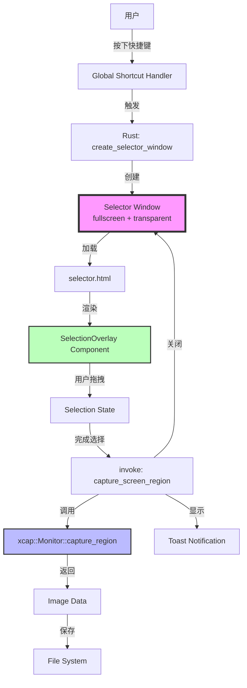
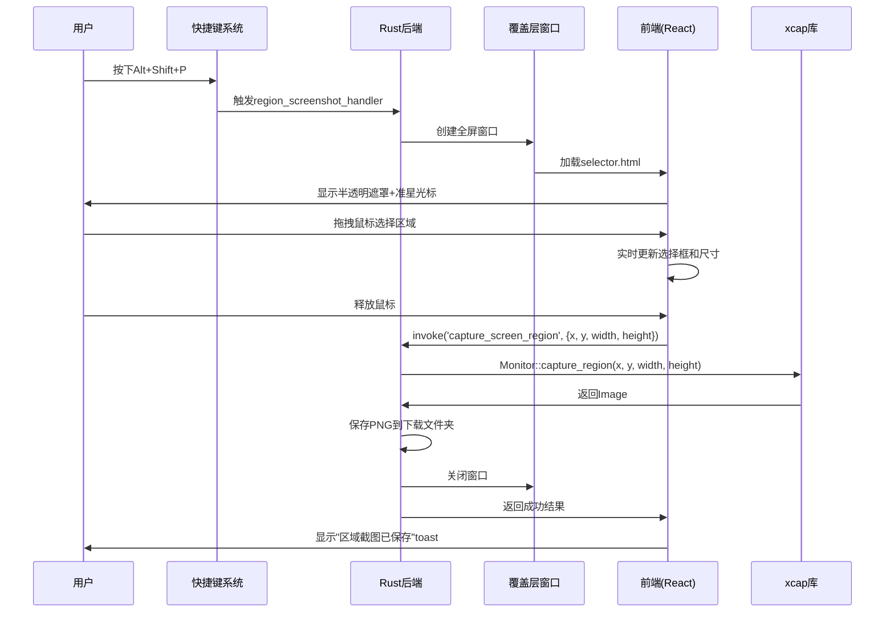

# 交互式屏幕区域截图功能 - 技术设计文档

## 概述

本文档描述交互式屏幕区域截图功能的技术设计。该功能通过创建独立的全屏覆盖层窗口,允许用户通过鼠标拖拽选择屏幕上的任意区域进行截图。

### 核心架构

```
用户按下快捷键(Alt+Shift+P)
    ↓
Rust后端接收快捷键事件
    ↓
创建全屏覆盖层窗口(独立于主Todo窗口)
    ↓
覆盖层显示选择UI(React组件)
    ↓
用户拖拽选择屏幕区域
    ↓
前端将选择坐标发送给Rust
    ↓
Rust调用xcap截取屏幕区域
    ↓
关闭覆盖层窗口
    ↓
保存截图并显示通知
```

### 关键技术点

1. **多窗口架构**: 主窗口(Todo) + 覆盖层窗口(选择器)
2. **屏幕级别截图**: 使用xcap捕获屏幕内容,不是窗口内容
3. **全屏覆盖**: 覆盖层窗口配置为fullscreen + transparent + alwaysOnTop
4. **独立HTML页面**: 覆盖层使用单独的selector.html
5. **Tauri命令通信**: 前端通过invoke调用Rust命令

## 系统架构

### 组件关系图



### 数据流图



## 后端设计(Rust)

### 1. 覆盖层窗口创建

**文件**: `src-tauri/src/lib.rs`

```rust
use tauri::{Manager, WebviewUrl, WebviewWindowBuilder};

// 快捷键触发时调用
fn create_selector_window(app: &tauri::AppHandle) -> Result<(), String> {
    // 检查是否已存在选择器窗口
    if app.get_webview_window("region-selector").is_some() {
        return Ok(()); // 已存在,不重复创建
    }
    
    // 获取主显示器尺寸
    let monitor = Monitor::all()
        .map_err(|e| e.to_string())?
        .into_iter()
        .find(|m| m.is_primary().unwrap_or(false))
        .ok_or("No primary monitor found")?;
    
    let width = monitor.width().map_err(|e| e.to_string())?;
    let height = monitor.height().map_err(|e| e.to_string())?;
    
    // 创建全屏覆盖层窗口
    WebviewWindowBuilder::new(
        app,
        "region-selector",
        WebviewUrl::App("selector.html".into())
    )
    .title("Region Selector")
    .inner_size(width as f64, height as f64)
    .position(0.0, 0.0)
    .decorations(false)      // 无边框
    .transparent(true)       // 透明背景
    .always_on_top(true)     // 始终置顶
    .skip_taskbar(true)      // 不显示在任务栏
    .resizable(false)        // 不可调整大小
    .fullscreen(true)        // 全屏
    .build()
    .map_err(|e| e.to_string())?;
    
    Ok(())
}
```

### 2. 区域截图Tauri命令

**文件**: `src-tauri/src/lib.rs`

```rust
use image::ImageFormat;
use std::path::PathBuf;
use chrono::Local;

#[derive(serde::Serialize, serde::Deserialize)]
struct ScreenshotResult {
    success: bool,
    path: Option<String>,
    error: Option<String>,
}

#[tauri::command]
fn capture_screen_region(
    app: tauri::AppHandle,
    x: i32,
    y: i32,
    width: u32,
    height: u32,
) -> Result<ScreenshotResult, String> {
    // 验证尺寸
    if width < 50 || height < 50 {
        return Ok(ScreenshotResult {
            success: false,
            path: None,
            error: Some("选择区域过小,最小尺寸为50x50像素".to_string()),
        });
    }
    
    // 获取主显示器
    let monitor = Monitor::all()
        .map_err(|e| e.to_string())?
        .into_iter()
        .find(|m| m.is_primary().unwrap_or(false))
        .ok_or("No primary monitor found")?;
    
    // 获取显示器尺寸用于边界检查
    let monitor_width = monitor.width().map_err(|e| e.to_string())? as i32;
    let monitor_height = monitor.height().map_err(|e| e.to_string())? as i32;
    
    // 边界检查和调整
    let x = x.max(0).min(monitor_width - width as i32);
    let y = y.max(0).min(monitor_height - height as i32);
    let width = width.min((monitor_width - x) as u32);
    let height = height.min((monitor_height - y) as u32);
    
    // 捕获屏幕区域
    let image = monitor
        .capture_region(x, y, width, height)
        .map_err(|e| e.to_string())?;
    
    // 生成文件名
    let timestamp = Local::now().format("%Y%m%d_%H%M%S").to_string();
    let filename = format!("screenshot_region_{}.png", timestamp);
    
    // 获取下载文件夹路径
    let download_dir = dirs::download_dir()
        .ok_or("Could not find download directory")?;
    let file_path = download_dir.join(&filename);
    
    // 保存图片
    image
        .save_with_format(&file_path, ImageFormat::Png)
        .map_err(|e| e.to_string())?;
    
    // 关闭选择器窗口
    if let Some(window) = app.get_webview_window("region-selector") {
        window.close().ok();
    }
    
    Ok(ScreenshotResult {
        success: true,
        path: Some(file_path.to_string_lossy().to_string()),
        error: None,
    })
}
```

### 3. 快捷键处理器扩展

**文件**: `src-tauri/src/lib.rs`

```rust
use tauri_plugin_global_shortcut::{GlobalShortcutExt, Shortcut};

// 在setup函数中注册快捷键
fn setup_shortcuts(app: &tauri::App) -> Result<(), Box<dyn std::error::Error>> {
    // ... 现有的全屏截图快捷键 ...
    
    // 注册区域截图快捷键
    let region_shortcut = "Alt+Shift+P".parse::<Shortcut>()?;
    let app_handle = app.handle().clone();
    
    app.global_shortcut().on_shortcut(region_shortcut, move |_app, _event, _shortcut| {
        if let Err(e) = create_selector_window(&app_handle) {
            eprintln!("Failed to create selector window: {}", e);
        }
    })?;
    
    Ok(())
}
```

### 4. 命令注册

**文件**: `src-tauri/src/lib.rs`

```rust
#[cfg_attr(mobile, tauri::mobile_entry_point)]
pub fn run() {
    tauri::Builder::default()
        .plugin(tauri_plugin_opener::init())
        .plugin(tauri_plugin_store::Builder::new().build())
        .plugin(tauri_plugin_global_shortcut::Builder::new().build())
        .setup(|app| {
            setup_shortcuts(app)?;
            Ok(())
        })
        .invoke_handler(tauri::generate_handler![
            capture_screenshot,      // 现有的全屏截图
            capture_screen_region,   // 新增的区域截图
        ])
        .run(tauri::generate_context!())
        .expect("error while running tauri application");
}
```

## 前端设计(TypeScript + React)

### 1. 覆盖层HTML页面

**文件**: `selector.html` (新建)

```html
<!DOCTYPE html>
<html lang="en">
<head>
    <meta charset="UTF-8">
    <meta name="viewport" content="width=device-width, initial-scale=1.0">
    <title>Region Selector</title>
    <style>
        * {
            margin: 0;
            padding: 0;
            box-sizing: border-box;
        }
        
        body {
            width: 100vw;
            height: 100vh;
            overflow: hidden;
            cursor: crosshair;
            user-select: none;
        }
        
        #root {
            width: 100%;
            height: 100%;
        }
    </style>
</head>
<body>
    <div id="root"></div>
    <script type="module" src="/src/selector.tsx"></script>
</body>
</html>
```

### 2. 选择器入口文件

**文件**: `src/selector.tsx` (新建)

```typescript
import React from 'react'
import ReactDOM from 'react-dom/client'
import { SelectionOverlay } from './components/selection-overlay'
import './selector.css'

ReactDOM.createRoot(document.getElementById('root')!).render(
  <React.StrictMode>
    <SelectionOverlay />
  </React.StrictMode>,
)
```

### 3. 选择器样式

**文件**: `src/selector.css` (新建)

```css
body {
    margin: 0;
    padding: 0;
    width: 100vw;
    height: 100vh;
    overflow: hidden;
}

#root {
    width: 100%;
    height: 100%;
}
```

### 4. 选择覆盖层组件

**文件**: `src/components/selection-overlay.tsx` (新建)

```typescript
import { useState, useRef, useEffect } from 'react'
import { invoke } from '@tauri-apps/api/core'
import { getCurrentWindow } from '@tauri-apps/api/window'
import { toast } from 'sonner'

interface SelectionRect {
  startX: number
  startY: number
  endX: number
  endY: number
}

export function SelectionOverlay() {
  const [isSelecting, setIsSelecting] = useState(false)
  const [selection, setSelection] = useState<SelectionRect | null>(null)
  const overlayRef = useRef<HTMLDivElement>(null)

  // 处理鼠标按下
  const handleMouseDown = (e: React.MouseEvent) => {
    if (e.button !== 0) return // 只处理左键

    setIsSelecting(true)
    setSelection({
      startX: e.clientX,
      startY: e.clientY,
      endX: e.clientX,
      endY: e.clientY,
    })
  }

  // 处理鼠标移动
  const handleMouseMove = (e: React.MouseEvent) => {
    if (!isSelecting || !selection) return

    setSelection({
      ...selection,
      endX: e.clientX,
      endY: e.clientY,
    })
  }

  // 处理鼠标释放
  const handleMouseUp = async () => {
    if (!isSelecting || !selection) return

    setIsSelecting(false)

    // 计算选择区域
    const x = Math.min(selection.startX, selection.endX)
    const y = Math.min(selection.startY, selection.endY)
    const width = Math.abs(selection.endX - selection.startX)
    const height = Math.abs(selection.endY - selection.startY)

    // 检查最小尺寸
    if (width < 50 || height < 50) {
      toast.error('选择区域过小,请重新选择')
      setSelection(null)
      return
    }

    try {
      // 调用Rust命令截图
      const result = await invoke<{success: boolean, path?: string, error?: string}>(
        'capture_screen_region',
        { x, y, width, height }
      )

      if (result.success) {
        toast.success('区域截图已保存')
        // 窗口会在Rust端关闭
      } else {
        toast.error(result.error || '区域截图失败')
        setSelection(null)
      }
    } catch (error) {
      console.error('Screenshot failed:', error)
      toast.error('区域截图失败')
      setSelection(null)
    }
  }

  // 处理右键点击取消
  const handleContextMenu = (e: React.MouseEvent) => {
    e.preventDefault()
    getCurrentWindow().close()
  }

  // 处理Esc键取消
  useEffect(() => {
    const handleKeyDown = (e: KeyboardEvent) => {
      if (e.key === 'Escape') {
        getCurrentWindow().close()
      }
    }

    window.addEventListener('keydown', handleKeyDown)
    return () => window.removeEventListener('keydown', handleKeyDown)
  }, [])

  // 计算选择框样式
  const getSelectionStyle = () => {
    if (!selection) return {}

    const x = Math.min(selection.startX, selection.endX)
    const y = Math.min(selection.startY, selection.endY)
    const width = Math.abs(selection.endX - selection.startX)
    const height = Math.abs(selection.endY - selection.startY)

    return {
      left: `${x}px`,
      top: `${y}px`,
      width: `${width}px`,
      height: `${height}px`,
    }
  }

  // 计算尺寸显示位置
  const getSizeDisplayStyle = () => {
    if (!selection) return {}

    const x = Math.min(selection.startX, selection.endX)
    const y = Math.min(selection.startY, selection.endY)
    const width = Math.abs(selection.endX - selection.startX)

    return {
      left: `${x + width + 10}px`,
      top: `${y - 30}px`,
    }
  }

  const width = selection ? Math.abs(selection.endX - selection.startX) : 0
  const height = selection ? Math.abs(selection.endY - selection.startY) : 0

  return (
    <div
      ref={overlayRef}
      className="selection-overlay"
      onMouseDown={handleMouseDown}
      onMouseMove={handleMouseMove}
      onMouseUp={handleMouseUp}
      onContextMenu={handleContextMenu}
    >
      {/* 半透明遮罩 */}
      <div className="overlay-mask" />

      {/* 选择框 */}
      {selection && (
        <>
          <div className="selection-box" style={getSelectionStyle()} />
          <div className="size-display" style={getSizeDisplayStyle()}>
            {width} × {height}
          </div>
        </>
      )}
    </div>
  )
}
```

### 5. 选择覆盖层样式

**文件**: `src/components/selection-overlay.css` (新建)

```css
.selection-overlay {
  position: fixed;
  top: 0;
  left: 0;
  width: 100vw;
  height: 100vh;
  cursor: crosshair;
  user-select: none;
}

.overlay-mask {
  position: absolute;
  top: 0;
  left: 0;
  width: 100%;
  height: 100%;
  background-color: rgba(0, 0, 0, 0.6);
  pointer-events: none;
}

.selection-box {
  position: absolute;
  border: 3px solid #3b82f6;
  background-color: transparent;
  box-shadow: 0 0 0 9999px rgba(0, 0, 0, 0.6);
  pointer-events: none;
}

.size-display {
  position: absolute;
  background-color: rgba(59, 130, 246, 0.9);
  color: white;
  padding: 4px 12px;
  border-radius: 4px;
  font-size: 14px;
  font-weight: 600;
  font-family: monospace;
  pointer-events: none;
  white-space: nowrap;
  box-shadow: 0 2px 8px rgba(0, 0, 0, 0.3);
}
```

### 6. 快捷键系统扩展

**文件**: `src/lib/shortcuts.ts`

```typescript
import { register, unregister } from '@tauri-apps/plugin-global-shortcut'

let currentScreenshotShortcut: string | null = null
let currentRegionCaptureShortcut: string | null = null

// 注册区域截图快捷键
export async function registerRegionCaptureShortcut(shortcut: string): Promise<void> {
  // 检查与全屏截图快捷键冲突
  if (shortcut === currentScreenshotShortcut) {
    throw new Error('快捷键与全屏截图冲突')
  }

  // 注销现有快捷键
  if (currentRegionCaptureShortcut) {
    await unregisterRegionCaptureShortcut()
  }

  // 注册新快捷键
  await register(shortcut, () => {
    // 快捷键处理在Rust端,这里不需要额外处理
  })

  currentRegionCaptureShortcut = shortcut
}

// 注销区域截图快捷键
export async function unregisterRegionCaptureShortcut(): Promise<void> {
  if (currentRegionCaptureShortcut) {
    await unregister(currentRegionCaptureShortcut)
    currentRegionCaptureShortcut = null
  }
}

// 初始化快捷键(扩展现有函数)
export async function initializeShortcuts(
  screenshotShortcut: string,
  regionCaptureShortcut: string
): Promise<void> {
  try {
    await registerScreenshotShortcut(screenshotShortcut)
    await registerRegionCaptureShortcut(regionCaptureShortcut)
  } catch (error) {
    console.error('Failed to initialize shortcuts:', error)
    throw error
  }
}

// 清理快捷键(扩展现有函数)
export async function cleanupShortcuts(): Promise<void> {
  await unregisterScreenshotShortcut()
  await unregisterRegionCaptureShortcut()
}
```

### 7. 设置接口扩展

**文件**: `src/lib/settings.ts`

```typescript
export interface AppSettings {
  locale: Locale
  screenshotShortcut: string
  regionCaptureShortcut: string  // 新增
}

export const defaultSettings: AppSettings = {
  locale: 'zh-CN',
  screenshotShortcut: 'Alt+P',
  regionCaptureShortcut: 'Alt+Shift+P',  // 新增
}
```

### 8. 主窗口组件更新

**文件**: `src/components/todo-window.tsx`

```typescript
// 添加状态
const [regionCaptureShortcut, setRegionCaptureShortcut] = useState('Alt+Shift+P')

// 在loadAppSettings中加载
useEffect(() => {
  const loadSettings = async () => {
    const settings = await loadAppSettings()
    setLocale(settings.locale)
    setScreenshotShortcut(settings.screenshotShortcut)
    setRegionCaptureShortcut(settings.regionCaptureShortcut || 'Alt+Shift+P')

    // 初始化快捷键
    await initializeShortcuts(
      settings.screenshotShortcut,
      settings.regionCaptureShortcut || 'Alt+Shift+P'
    )
  }
  loadSettings()
}, [])

// 添加处理函数
const handleRegionShortcutChange = async (newShortcut: string) => {
  try {
    await updateRegionCaptureShortcut(newShortcut)
    setRegionCaptureShortcut(newShortcut)

    const settings = await loadAppSettings()
    await saveAppSettings({ ...settings, regionCaptureShortcut: newShortcut })

    toast.success('区域截图快捷键已更新')
  } catch (error) {
    console.error('Failed to update region shortcut:', error)
    toast.error('快捷键更新失败')
  }
}

// 在SettingsPopup中传递props
<SettingsPopup
  // ... 现有props ...
  regionCaptureShortcut={regionCaptureShortcut}
  onRegionShortcutChange={handleRegionShortcutChange}
/>
```

### 9. 设置弹窗更新

**文件**: `src/components/settings-popup.tsx`

```typescript
interface SettingsPopupProps {
  // ... 现有props ...
  regionCaptureShortcut: string
  onRegionShortcutChange: (shortcut: string) => void
}

export function SettingsPopup({
  // ... 现有props ...
  regionCaptureShortcut,
  onRegionShortcutChange,
}: SettingsPopupProps) {
  return (
    <div className="settings-popup">
      {/* ... 现有内容 ... */}

      {/* 分隔线 */}
      <div className="divider" />

      {/* 区域截图快捷键 */}
      <div className="setting-section">
        <label>区域截图快捷键</label>
        <ShortcutInput
          value={regionCaptureShortcut}
          onChange={onRegionShortcutChange}
          placeholder="Alt+Shift+P"
        />
      </div>
    </div>
  )
}
```

## 构建配置

### Vite配置更新

**文件**: `vite.config.ts`

```typescript
export default defineConfig({
  // ... 现有配置 ...

  build: {
    rollupOptions: {
      input: {
        main: resolve(__dirname, 'index.html'),
        selector: resolve(__dirname, 'selector.html'),  // 新增
      },
    },
  },
})
```

## 错误处理

### 1. 覆盖层窗口创建失败
- **场景**: 显示器信息获取失败
- **处理**: 记录错误日志,显示toast提示

### 2. 截图失败
- **场景**: xcap调用失败、权限不足、磁盘空间不足
- **处理**: 返回错误信息,显示详细toast,保持覆盖层允许重试

### 3. 选择区域过小
- **场景**: 用户选择的区域小于50x50
- **处理**: 显示toast提示,保持覆盖层允许重新选择

### 4. 快捷键冲突
- **场景**: 区域截图快捷键与全屏截图相同
- **处理**: 拒绝保存,显示错误提示

## 性能优化

### 1. 覆盖层渲染优化
- 使用CSS transform而非top/left进行位置更新
- 使用requestAnimationFrame节流鼠标移动事件
- 选择框使用box-shadow而非多个div实现遮罩效果

### 2. 内存管理
- 覆盖层窗口使用后立即关闭
- 避免在覆盖层中加载不必要的资源

### 3. 响应速度
- 覆盖层窗口预加载HTML(可选)
- 使用轻量级React组件
- 最小化JavaScript bundle大小

## 安全考虑

### 1. 坐标验证
- 在Rust端验证所有坐标参数
- 确保坐标在屏幕边界内
- 防止负数或过大的值

### 2. 权限检查
- 确保应用有屏幕录制权限(macOS)
- 处理权限被拒绝的情况

### 3. 文件系统安全
- 使用dirs库获取标准下载文件夹
- 验证文件路径,防止路径遍历攻击
- 使用安全的文件名生成(时间戳)

## 测试策略

### 1. 单元测试
- 坐标验证函数测试
- 边界检查逻辑测试
- 文件名生成测试

### 2. 集成测试
- 覆盖层窗口创建和关闭
- 快捷键注册和触发
- 截图命令调用

### 3. 手动测试
- 不同DPI设置下的坐标准确性
- 多显示器场景(当前仅支持主显示器)
- 跨平台一致性(Windows、macOS、Linux)

## 国际化

### 文本资源

**文件**: `src/lib/i18n.ts`

```typescript
const translations = {
  'zh-CN': {
    'region.screenshot.saved': '区域截图已保存',
    'region.screenshot.failed': '区域截图失败',
    'region.screenshot.too.small': '选择区域过小,请重新选择',
    'region.shortcut.conflict': '快捷键与全屏截图冲突',
    'region.shortcut.updated': '区域截图快捷键已更新',
  },
  'en': {
    'region.screenshot.saved': 'Region screenshot saved',
    'region.screenshot.failed': 'Region screenshot failed',
    'region.screenshot.too.small': 'Selected region too small, please try again',
    'region.shortcut.conflict': 'Shortcut conflicts with full screenshot',
    'region.shortcut.updated': 'Region screenshot shortcut updated',
  },
}
```

## 部署注意事项

### 1. 依赖项
- 确保xcap 0.7已在Cargo.toml中
- 确保Tauri 2.x及相关插件版本正确

### 2. 权限
- macOS: 需要在Info.plist中添加屏幕录制权限说明
- Windows: 无特殊权限要求
- Linux: 确保X11或Wayland支持

### 3. 打包
- selector.html需要包含在构建输出中
- 确保Vite正确处理多入口点

## 未来增强

1. **多显示器支持**: 允许在多个显示器上选择区域
2. **选择框调整**: 选择后可调整大小和位置
3. **固定比例选择**: 支持16:9等固定比例
4. **选择历史**: 记录最近使用的选择区域
5. **延迟截图**: 选择后延迟几秒再截图
6. **滚动截图**: 支持截取超出屏幕的长内容


