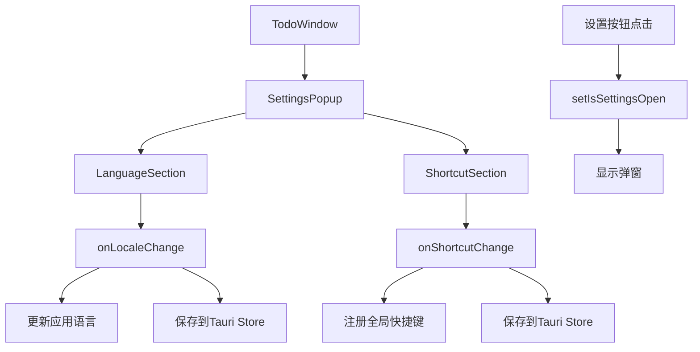

# 设置弹窗功能设计规格

## 概述

本文档详细描述了设置弹窗功能的技术设计，包括组件架构、数据流、UI设计和实现细节。设计基于现有的React + TypeScript + Tailwind CSS + Radix UI技术栈。

## 架构设计

### 组件层次结构

```
TodoWindow
├── SettingsPopup (新增)
│   ├── Dialog (Radix UI)
│   │   ├── DialogOverlay
│   │   └── DialogContent
│   │       ├── DialogHeader
│   │       │   ├── DialogTitle
│   │       │   └── DialogClose
│   │       └── SettingsContent
│   │           ├── LanguageSection
│   │           │   ├── SectionTitle
│   │           │   └── LanguageSelector
│   │           │       └── RadioGroup (Radix UI)
│   │           └── ShortcutSection
│   │               ├── SectionTitle
│   │               └── ShortcutInput
│   │                   └── KeyCaptureInput
└── 现有组件...
```

### 数据流设计



## 技术实现

### 状态管理

```typescript
// TodoWindow组件新增状态
const [isSettingsOpen, setIsSettingsOpen] = useState(false)
const [screenshotShortcut, setScreenshotShortcut] = useState<string>("")

// 设置相关的状态类型
interface SettingsState {
  locale: Locale
  screenshotShortcut: string
}
```

### 依赖集成

#### 1. Radix UI Dialog
- 已存在于项目中：`@radix-ui/react-dialog: ^1.1.15`
- 用于弹窗的基础结构和无障碍访问

#### 2. 新增依赖
```json
{
  "html2canvas": "^1.4.1",
  "@tauri-apps/plugin-global-shortcut": "^2.0.0"
}
```

#### 3. Tauri配置更新
```json
// src-tauri/Cargo.toml
[dependencies]
tauri-plugin-global-shortcut = "2.0"

// src-tauri/src/lib.rs
.plugin(tauri_plugin_global_shortcut::Builder::new().build())
```

## UI设计规格

### 弹窗容器设计

```css
/* 弹窗遮罩层 */
.settings-overlay {
  @apply fixed inset-0 z-50 bg-black/50 backdrop-blur-sm;
  animation: fade-in 200ms ease-out;
}

/* 弹窗内容区域 */
.settings-content {
  @apply fixed bottom-0 left-0 right-0 z-50;
  @apply bg-card border-t border-border/50 rounded-t-xl;
  @apply max-h-[70vh] overflow-y-auto;
  animation: slide-up 200ms ease-out;
}

/* 动画定义 */
@keyframes slide-up {
  from { transform: translateY(100%); }
  to { transform: translateY(0); }
}

@keyframes slide-down {
  from { transform: translateY(0); }
  to { transform: translateY(100%); }
}

@keyframes fade-in {
  from { opacity: 0; }
  to { opacity: 1; }
}
```

### 内容布局设计

```typescript
// 弹窗内容结构
<DialogContent className="settings-content">
  <DialogHeader className="px-6 py-4 border-b border-border/50">
    <DialogTitle className="text-lg font-semibold">设置</DialogTitle>
    <DialogClose className="absolute right-4 top-4" />
  </DialogHeader>
  
  <div className="px-6 py-4 space-y-6">
    <LanguageSection />
    <Separator />
    <ShortcutSection />
  </div>
</DialogContent>
```

### 语言选择器设计

```typescript
// 使用Radix UI RadioGroup
<RadioGroup value={locale} onValueChange={onLocaleChange}>
  <div className="flex items-center space-x-2">
    <RadioGroupItem value="zh-CN" id="zh-CN" />
    <Label htmlFor="zh-CN">中文</Label>
  </div>
  <div className="flex items-center space-x-2">
    <RadioGroupItem value="en" id="en" />
    <Label htmlFor="en">English</Label>
  </div>
</RadioGroup>
```

### 快捷键输入设计

```typescript
// 快捷键捕获组件
const KeyCaptureInput = ({ value, onChange }) => {
  const [isCapturing, setIsCapturing] = useState(false)
  const [keys, setKeys] = useState<string[]>([])
  
  const handleKeyDown = (e: KeyboardEvent) => {
    if (!isCapturing) return
    
    e.preventDefault()
    const newKeys = []
    
    if (e.ctrlKey || e.metaKey) newKeys.push(e.ctrlKey ? 'Ctrl' : 'Cmd')
    if (e.shiftKey) newKeys.push('Shift')
    if (e.altKey) newKeys.push('Alt')
    
    if (e.key.length === 1 || /^F\d+$/.test(e.key)) {
      newKeys.push(e.key.toUpperCase())
    }
    
    if (newKeys.length > 1) {
      setKeys(newKeys)
      onChange(newKeys.join('+'))
      setIsCapturing(false)
    }
  }
  
  return (
    <Input
      value={isCapturing ? '按下快捷键...' : value || '点击设置快捷键'}
      onClick={() => setIsCapturing(true)}
      onKeyDown={handleKeyDown}
      readOnly
      className="cursor-pointer"
    />
  )
}
```

## 样式规范

### 颜色方案
- 背景色：`bg-card` (白色/深色主题自适应)
- 边框色：`border-border/50` (半透明边框)
- 文本色：`text-foreground` (主文本色)
- 次要文本：`text-muted-foreground`
- 遮罩层：`bg-black/50 backdrop-blur-sm`

### 间距规范
- 弹窗内边距：`px-6 py-4`
- 区块间距：`space-y-6`
- 元素间距：`space-x-2`, `gap-2`
- 圆角：`rounded-t-xl` (顶部圆角)

### 动画规范
- 动画时长：200ms
- 缓动函数：`ease-out`
- 弹窗进入：从底部向上滑动
- 弹窗退出：向底部滑动
- 遮罩层：淡入淡出

## 组件接口设计

### SettingsPopup组件

```typescript
interface SettingsPopupProps {
  open: boolean
  onOpenChange: (open: boolean) => void
  locale: Locale
  onLocaleChange: (locale: Locale) => void
  screenshotShortcut: string
  onShortcutChange: (shortcut: string) => void
}

export function SettingsPopup({
  open,
  onOpenChange,
  locale,
  onLocaleChange,
  screenshotShortcut,
  onShortcutChange
}: SettingsPopupProps) {
  // 组件实现
}
```

### LanguageSection组件

```typescript
interface LanguageSectionProps {
  locale: Locale
  onLocaleChange: (locale: Locale) => void
}

export function LanguageSection({
  locale,
  onLocaleChange
}: LanguageSectionProps) {
  const t = useTranslation(locale)
  
  return (
    <div className="space-y-3">
      <h3 className="text-sm font-medium">{t.language}</h3>
      <RadioGroup value={locale} onValueChange={onLocaleChange}>
        {/* 语言选项 */}
      </RadioGroup>
    </div>
  )
}
```

### ShortcutSection组件

```typescript
interface ShortcutSectionProps {
  shortcut: string
  onShortcutChange: (shortcut: string) => void
}

export function ShortcutSection({
  shortcut,
  onShortcutChange
}: ShortcutSectionProps) {
  const t = useTranslation(locale)
  
  return (
    <div className="space-y-3">
      <h3 className="text-sm font-medium">{t.screenshotShortcut}</h3>
      <KeyCaptureInput
        value={shortcut}
        onChange={onShortcutChange}
      />
    </div>
  )
}
```

## 数据持久化

### Tauri Store集成

```typescript
// 设置数据结构
interface AppSettings {
  locale: Locale
  screenshotShortcut: string
}

// 保存设置
const saveSettings = async (settings: AppSettings) => {
  try {
    const store = await load('settings.json', { autoSave: true })
    await store.set('settings', settings)
    await store.save()
  } catch (error) {
    console.error('Failed to save settings:', error)
  }
}

// 加载设置
const loadSettings = async (): Promise<AppSettings | null> => {
  try {
    const store = await load('settings.json', { autoSave: true })
    return await store.get<AppSettings>('settings')
  } catch (error) {
    console.error('Failed to load settings:', error)
    return null
  }
}
```

### 全局快捷键注册

```typescript
import { register, unregister } from '@tauri-apps/plugin-global-shortcut'

// 注册快捷键
const registerShortcut = async (shortcut: string) => {
  try {
    // 先注销现有快捷键
    await unregister(shortcut).catch(() => {})
    
    // 注册新快捷键
    await register(shortcut, () => {
      // 触发截图功能
      handleScreenshot()
    })
  } catch (error) {
    console.error('Failed to register shortcut:', error)
    throw new Error('快捷键注册失败，可能与系统快捷键冲突')
  }
}

// 截图功能（预留）
const handleScreenshot = async () => {
  // 使用html2canvas实现截图
  // 暂时只是占位实现
  console.log('Screenshot triggered')
}
```

## 国际化扩展

### i18n文本扩展

```typescript
// src/lib/i18n.ts 扩展
export const translations = {
  en: {
    // 现有翻译...
    settings: "Settings",
    language: "Language",
    screenshotShortcut: "Screenshot Shortcut",
    clickToSetShortcut: "Click to set shortcut",
    pressingShortcut: "Press shortcut keys...",
    shortcutConflict: "Shortcut conflicts with system shortcuts",
    chinese: "Chinese",
    english: "English",
    // 错误和提示信息
    settingsSaveError: "Failed to save settings",
    settingsLoadError: "Failed to load settings",
    shortcutRegisterError: "Failed to register shortcut",
    shortcutInvalidError: "Invalid shortcut combination",
    checkPermissions: "Please check app permissions and try again",
    shortcutAlreadyUsed: "This shortcut is already in use",
    shortcutRegistered: "Shortcut registered successfully",
    settingsSaved: "Settings saved successfully"
  },
  "zh-CN": {
    // 现有翻译...
    settings: "设置",
    language: "语言",
    screenshotShortcut: "截图快捷键",
    clickToSetShortcut: "点击设置快捷键",
    pressingShortcut: "按下快捷键...",
    shortcutConflict: "快捷键与系统快捷键冲突",
    chinese: "中文",
    english: "英文",
    // 错误和提示信息
    settingsSaveError: "设置保存失败",
    settingsLoadError: "设置加载失败",
    shortcutRegisterError: "快捷键注册失败",
    shortcutInvalidError: "无效的快捷键组合",
    checkPermissions: "请检查应用权限并重试",
    shortcutAlreadyUsed: "此快捷键已被占用",
    shortcutRegistered: "快捷键注册成功",
    settingsSaved: "设置保存成功"
  }
}
```

## 错误处理

### 快捷键冲突处理

```typescript
const handleShortcutError = (error: Error, locale: Locale) => {
  const t = useTranslation(locale)
  // 使用国际化的错误信息
  toast({
    title: t.shortcutRegisterError,
    description: error.message.includes('conflict') ? t.shortcutConflict : t.shortcutInvalidError,
    variant: "destructive"
  })
}
```

### 设置保存失败处理

```typescript
const handleSaveError = (error: Error, locale: Locale) => {
  const t = useTranslation(locale)
  toast({
    title: t.settingsSaveError,
    description: t.checkPermissions,
    variant: "destructive"
  })
}
```

## 性能考虑

### 懒加载
- 弹窗组件仅在需要时渲染
- 快捷键监听仅在设置时激活

### 内存优化
- 组件卸载时清理事件监听器
- 快捷键注册失败时及时清理

### 动画性能
- 使用CSS transform而非position变化
- 启用硬件加速：`will-change: transform`

## 测试策略

### 单元测试
- 组件渲染测试
- 状态变更测试
- 事件处理测试

### 集成测试
- 弹窗打开/关闭流程
- 语言切换功能
- 快捷键设置流程

### 端到端测试
- 完整的用户交互流程
- 跨平台兼容性测试
- 快捷键冲突处理测试
