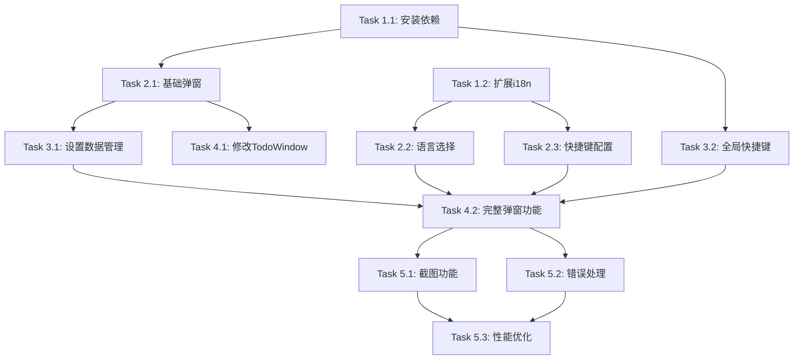

# 设置弹窗功能任务分解

## 任务概述

将设置弹窗功能分解为可执行的原子任务，每个任务专注于1-3个文件的修改，确保任务之间的依赖关系清晰。

## 任务列表

### 阶段1：基础设施准备

- [x] **Task 1.1: 安装必要依赖**
  - 文件：`package.json`, `src-tauri/Cargo.toml`, `src-tauri/src/lib.rs`
  - 需求：FR-003, NFR-001
  - 描述：安装html2canvas和global-shortcut插件，配置Tauri后端
  
  _Prompt: 实现spec settings-popup的任务，首先运行spec-workflow-guide获取工作流程指南然后实现任务：
  
  **Role**: 依赖管理专家，负责JavaScript和Rust依赖的安装和配置
  
  **Task**: 为设置弹窗功能安装必要的依赖包，包括html2canvas用于截图功能和Tauri global-shortcut插件用于全局快捷键支持。需要同时配置前端和后端依赖。
  
  **Restrictions**: 
  - 必须使用包管理器而非手动编辑配置文件
  - 确保版本兼容性
  - 不要破坏现有依赖
  
  **_Leverage**: 
  - 现有的package.json结构
  - 现有的Tauri配置文件
  - Tauri v2插件系统
  
  **_Requirements**: FR-003 (快捷键配置), NFR-001 (性能要求)
  
  **Success**: 
  - html2canvas成功安装到前端依赖
  - global-shortcut插件成功添加到Tauri配置
  - 应用能够正常启动
  - 新依赖不超过100KB包大小增量
  
  **Instructions**: 在tasks.md中将此任务标记为进行中[-]，完成后标记为完成[x]

- [x] **Task 1.2: 扩展国际化文本**
  - 文件：`src/lib/i18n.ts`
  - 需求：FR-002, NFR-002
  - 描述：为设置弹窗添加完整的中英文翻译文本，包括所有用户可见的文本和错误提示

  _Prompt: 实现spec settings-popup的任务，首先运行spec-workflow-guide获取工作流程指南然后实现任务：

  **Role**: 国际化专家，负责多语言文本管理和翻译

  **Task**: 扩展现有的i18n系统，为设置弹窗功能添加完整的中英文翻译文本，包括界面文本、提示信息、错误消息等所有用户可见的内容（日志除外）。

  **Restrictions**:
  - 保持现有i18n结构不变
  - 确保翻译准确性和一致性
  - 不要修改现有翻译文本
  - **所有用户可见的文本都必须国际化，包括错误提示、成功消息、占位符文本等**

  **_Leverage**:
  - 现有的i18n.ts文件结构
  - 现有的翻译模式
  - useTranslation hook

  **_Requirements**: FR-002 (语言切换功能), NFR-002 (可用性要求)

  **Success**:
  - 添加设置相关的完整中英文翻译
  - 包含所有界面文本、错误信息、提示消息的翻译
  - 翻译文本准确且符合应用风格
  - 不破坏现有翻译功能
  - 支持所有设置弹窗界面元素和交互反馈

  **Instructions**: 在tasks.md中将此任务标记为进行中[-]，完成后标记为完成[x]

### 阶段2：核心组件开发

- [x] **Task 2.1: 创建基础弹窗组件**
  - 文件：`src/components/settings-popup.tsx`
  - 需求：FR-001, FR-004
  - 描述：使用Radix UI Dialog创建基础弹窗结构和动画
  
  _Prompt: 实现spec settings-popup的任务，首先运行spec-workflow-guide获取工作流程指南然后实现任务：
  
  **Role**: React组件开发专家，专注于用户界面组件的创建和交互设计
  
  **Task**: 创建SettingsPopup组件，使用Radix UI Dialog实现从底部向上滑出的弹窗，包含标题栏、关闭按钮和内容区域的基础结构。
  
  **Restrictions**: 
  - 必须使用Radix UI Dialog作为基础
  - 保持与现有应用的样式一致性
  - 确保无障碍访问支持
  - 动画时长必须为200ms
  
  **_Leverage**: 
  - 现有的Radix UI组件
  - 现有的Tailwind CSS样式系统
  - 现有的Button组件
  - 侧边栏的slide动画模式
  
  **_Requirements**: FR-001 (设置弹窗显示), FR-004 (弹窗交互)
  
  **Success**: 
  - 弹窗能够从底部平滑滑出
  - 支持ESC键和外部点击关闭
  - 样式与应用保持一致
  - 具备完整的TypeScript类型定义
  
  **Instructions**: 在tasks.md中将此任务标记为进行中[-]，完成后标记为完成[x]

- [x] **Task 2.2: 创建语言选择组件**
  - 文件：`src/components/language-section.tsx`
  - 需求：FR-002
  - 描述：实现语言切换界面，使用RadioGroup组件
  
  _Prompt: 实现spec settings-popup的任务，首先运行spec-workflow-guide获取工作流程指南然后实现任务：
  
  **Role**: 用户界面组件开发专家，专注于表单控件和用户交互
  
  **Task**: 创建LanguageSection组件，使用Radix UI RadioGroup实现语言选择器，支持中文和英文切换，并提供清晰的视觉反馈。
  
  **Restrictions**: 
  - 必须使用Radix UI RadioGroup
  - 保持现有语言切换逻辑兼容
  - 确保选中状态的视觉反馈清晰
  
  **_Leverage**: 
  - 现有的Radix UI组件
  - 现有的语言切换逻辑
  - 现有的Label组件样式
  - i18n系统
  
  **_Requirements**: FR-002 (语言切换功能)
  
  **Success**: 
  - 语言选择器正确显示当前语言
  - 切换语言立即生效
  - 视觉样式与应用一致
  - 支持键盘导航
  
  **Instructions**: 在tasks.md中将此任务标记为进行中[-]，完成后标记为完成[x]

- [x] **Task 2.3: 创建快捷键配置组件**
  - 文件：`src/components/shortcut-section.tsx`
  - 需求：FR-003
  - 描述：实现快捷键捕获和显示功能
  
  _Prompt: 实现spec settings-popup的任务，首先运行spec-workflow-guide获取工作流程指南然后实现任务：
  
  **Role**: 高级前端开发专家，专注于复杂用户交互和键盘事件处理
  
  **Task**: 创建ShortcutSection组件，包含快捷键输入框和捕获逻辑，支持Ctrl/Cmd+字母/数字组合键的捕获和显示。
  
  **Restrictions**: 
  - 只支持Ctrl/Cmd + 字母/数字组合
  - 必须提供清晰的用户反馈
  - 防止捕获系统保留快捷键
  
  **_Leverage**: 
  - 现有的Input组件
  - 现有的事件处理模式
  - KeyboardEvent API
  - 现有的错误处理机制
  
  **_Requirements**: FR-003 (快捷键配置)
  
  **Success**: 
  - 能够正确捕获快捷键组合
  - 显示格式化的快捷键文本
  - 提供捕获状态的视觉反馈
  - 处理无效快捷键输入
  
  **Instructions**: 在tasks.md中将此任务标记为进行中[-]，完成后标记为完成[x]

### 阶段3：数据管理和持久化

- [x] **Task 3.1: 实现设置数据管理**
  - 文件：`src/lib/settings.ts`
  - 需求：FR-002, FR-003, NFR-003
  - 描述：创建设置数据的保存和加载逻辑
  
  _Prompt: 实现spec settings-popup的任务，首先运行spec-workflow-guide获取工作流程指南然后实现任务：
  
  **Role**: 数据管理专家，专注于应用状态持久化和Tauri集成
  
  **Task**: 创建设置数据管理模块，使用Tauri Store实现设置的保存和加载，包括语言偏好和快捷键配置的持久化存储。
  
  **Restrictions**: 
  - 必须使用Tauri Store API
  - 确保数据格式的向后兼容性
  - 提供完整的错误处理
  
  **_Leverage**: 
  - 现有的Tauri Store使用模式
  - 现有的错误处理机制
  - TypeScript类型系统
  - 现有的todo数据存储模式
  
  **_Requirements**: FR-002 (语言切换功能), FR-003 (快捷键配置), NFR-003 (兼容性要求)
  
  **Success**: 
  - 设置能够正确保存到本地存储
  - 应用重启后设置能够正确加载
  - 提供完整的错误处理和恢复机制
  - 数据结构清晰且可扩展
  
  **Instructions**: 在tasks.md中将此任务标记为进行中[-]，完成后标记为完成[x]

- [x] **Task 3.2: 集成全局快捷键功能**
  - 文件：`src/lib/shortcuts.ts`
  - 需求：FR-003, NFR-001
  - 描述：实现全局快捷键的注册和管理
  
  _Prompt: 实现spec settings-popup的任务，首先运行spec-workflow-guide获取工作流程指南然后实现任务：
  
  **Role**: 系统集成专家，专注于Tauri插件集成和系统级功能
  
  **Task**: 创建全局快捷键管理模块，使用Tauri global-shortcut插件实现快捷键的注册、注销和冲突处理，为未来的截图功能做准备。
  
  **Restrictions**: 
  - 必须处理快捷键冲突情况
  - 确保跨平台兼容性
  - 提供清晰的错误信息
  
  **_Leverage**: 
  - Tauri global-shortcut插件API
  - 现有的错误处理模式
  - 现有的toast通知系统
  - 跨平台键盘事件处理
  
  **_Requirements**: FR-003 (快捷键配置), NFR-001 (性能要求)
  
  **Success**: 
  - 快捷键能够在系统级别正确注册
  - 冲突检测和错误处理完善
  - 支持快捷键的动态更新
  - 应用关闭时正确清理快捷键
  
  **Instructions**: 在tasks.md中将此任务标记为进行中[-]，完成后标记为完成[x]

### 阶段4：主组件集成

- [x] **Task 4.1: 修改TodoWindow组件集成弹窗**
  - 文件：`src/components/todo-window.tsx`
  - 需求：FR-001, FR-004
  - 描述：修改设置按钮行为，集成设置弹窗组件
  
  _Prompt: 实现spec settings-popup的任务，首先运行spec-workflow-guide获取工作流程指南然后实现任务：
  
  **Role**: React组件集成专家，专注于现有组件的修改和新功能集成
  
  **Task**: 修改TodoWindow组件，将设置按钮的点击行为从直接语言切换改为打开设置弹窗，并集成SettingsPopup组件到组件树中。
  
  **Restrictions**: 
  - 不能破坏现有的语言切换功能
  - 保持现有的UI布局不变
  - 确保两个设置按钮行为一致
  
  **_Leverage**: 
  - 现有的TodoWindow组件结构
  - 现有的状态管理模式
  - 现有的Button组件
  - React hooks模式
  
  **_Requirements**: FR-001 (设置弹窗显示), FR-004 (弹窗交互)
  
  **Success**: 
  - 主工具栏和侧边栏设置按钮都能打开弹窗
  - 弹窗状态管理正确
  - 现有功能不受影响
  - 组件渲染性能良好
  
  **Instructions**: 在tasks.md中将此任务标记为进行中[-]，完成后标记为完成[x]

- [x] **Task 4.2: 实现设置弹窗完整功能**
  - 文件：`src/components/settings-popup.tsx`
  - 需求：FR-001, FR-002, FR-003, FR-004
  - 描述：组装所有子组件，实现完整的设置弹窗功能
  
  _Prompt: 实现spec settings-popup的任务，首先运行spec-workflow-guide获取工作流程指南然后实现任务：
  
  **Role**: 高级React开发专家，专注于复杂组件的组装和状态管理
  
  **Task**: 完善SettingsPopup组件，集成LanguageSection和ShortcutSection，实现完整的设置功能，包括数据绑定、事件处理和状态同步。
  
  **Restrictions**: 
  - 确保所有子组件正确集成
  - 保持数据流的单向性
  - 提供完整的错误处理
  
  **_Leverage**: 
  - 已创建的子组件
  - 设置数据管理模块
  - 快捷键管理模块
  - 现有的错误处理机制
  
  **_Requirements**: FR-001 (设置弹窗显示), FR-002 (语言切换功能), FR-003 (快捷键配置), FR-004 (弹窗交互)
  
  **Success**: 
  - 所有设置功能正常工作
  - 数据正确保存和加载
  - 用户交互流畅自然
  - 错误处理完善
  
  **Instructions**: 在tasks.md中将此任务标记为进行中[-]，完成后标记为完成[x]

### 阶段5：测试和优化

- [x] **Task 5.1: 实现截图基础功能**
  - 文件：`src/lib/screenshot.ts`
  - 需求：FR-003
  - 描述：使用html2canvas实现基础截图功能
  
  _Prompt: 实现spec settings-popup的任务，首先运行spec-workflow-guide获取工作流程指南然后实现任务：
  
  **Role**: 图像处理专家，专注于DOM截图和图像处理功能
  
  **Task**: 创建截图功能模块，使用html2canvas实现DOM元素的截图功能，为快捷键触发的截图操作提供基础实现。
  
  **Restrictions**: 
  - 暂时只需要基础截图功能
  - 确保性能优化
  - 提供错误处理
  
  **_Leverage**: 
  - html2canvas库
  - 现有的错误处理模式
  - Tauri文件系统API
  - 现有的异步处理模式
  
  **_Requirements**: FR-003 (快捷键配置)
  
  **Success**: 
  - 能够正确截取DOM元素
  - 截图质量良好
  - 性能表现可接受
  - 错误处理完善
  
  **Instructions**: 在tasks.md中将此任务标记为进行中[-]，完成后标记为完成[x]

- [x] **Task 5.2: 完善错误处理和用户反馈**
  - 文件：`src/components/settings-popup.tsx`, `src/lib/shortcuts.ts`
  - 需求：NFR-002
  - 描述：添加完整的国际化错误处理和用户反馈机制

  _Prompt: 实现spec settings-popup的任务，首先运行spec-workflow-guide获取工作流程指南然后实现任务：

  **Role**: 用户体验专家，专注于错误处理和用户反馈机制

  **Task**: 完善设置弹窗的错误处理机制，添加用户友好的国际化错误提示和操作反馈，确保所有异常情况都有适当的多语言处理。

  **Restrictions**:
  - 错误信息必须用户友好且完全国际化
  - 保持界面的响应性
  - 不能影响正常功能流程
  - **所有用户可见的提示信息都必须支持中英文切换**

  **_Leverage**:
  - 现有的toast通知系统
  - 现有的错误处理模式
  - i18n系统用于错误信息翻译
  - 现有的加载状态处理

  **_Requirements**: NFR-002 (可用性要求)

  **Success**:
  - 所有错误情况都有国际化的适当提示
  - 用户操作有明确的多语言反馈
  - 错误恢复机制完善
  - 界面始终保持响应
  - 所有提示信息都支持语言切换

  **Instructions**: 在tasks.md中将此任务标记为进行中[-]，完成后标记为完成[x]

- [x] **Task 5.3: 性能优化和最终测试**
  - 文件：多个组件文件
  - 需求：NFR-001, NFR-002, NFR-003
  - 描述：进行性能优化和全面测试
  
  _Prompt: 实现spec settings-popup的任务，首先运行spec-workflow-guide获取工作流程指南然后实现任务：
  
  **Role**: 性能优化专家和质量保证工程师，专注于应用性能和功能验证
  
  **Task**: 对设置弹窗功能进行性能优化，包括动画性能、内存使用和响应速度，并进行全面的功能测试验证。
  
  **Restrictions**: 
  - 不能破坏现有功能
  - 必须满足所有性能要求
  - 确保跨平台兼容性
  
  **_Leverage**: 
  - React性能优化技术
  - 浏览器开发者工具
  - 现有的测试模式
  - Tauri性能监控
  
  **_Requirements**: NFR-001 (性能要求), NFR-002 (可用性要求), NFR-003 (兼容性要求)
  
  **Success**: 
  - 动画流畅无卡顿
  - 内存使用合理
  - 所有功能正常工作
  - 跨平台兼容性良好
  
  **Instructions**: 在tasks.md中将此任务标记为进行中[-]，完成后标记为完成[x]

## 任务依赖关系

## 验收标准

每个任务完成后需要满足以下标准：
1. 代码通过TypeScript编译
2. 功能按照需求规格正常工作
3. 样式与现有应用保持一致
4. 无控制台错误或警告
5. 相关测试通过（如适用）
6. **国际化要求**：
   - 所有用户可见的文本都必须通过i18n系统处理
   - 支持中英文完整切换
   - 错误提示、成功消息、占位符文本等都必须国际化
   - 语言切换后所有文本立即更新
   - 日志信息可以保持英文

## 风险缓解

- **依赖冲突**：在Task 1.1中仔细检查版本兼容性
- **动画性能**：在Task 2.1中使用CSS transform而非position
- **快捷键冲突**：在Task 3.2中实现完善的冲突检测
- **跨平台兼容**：在Task 5.3中进行全平台测试
