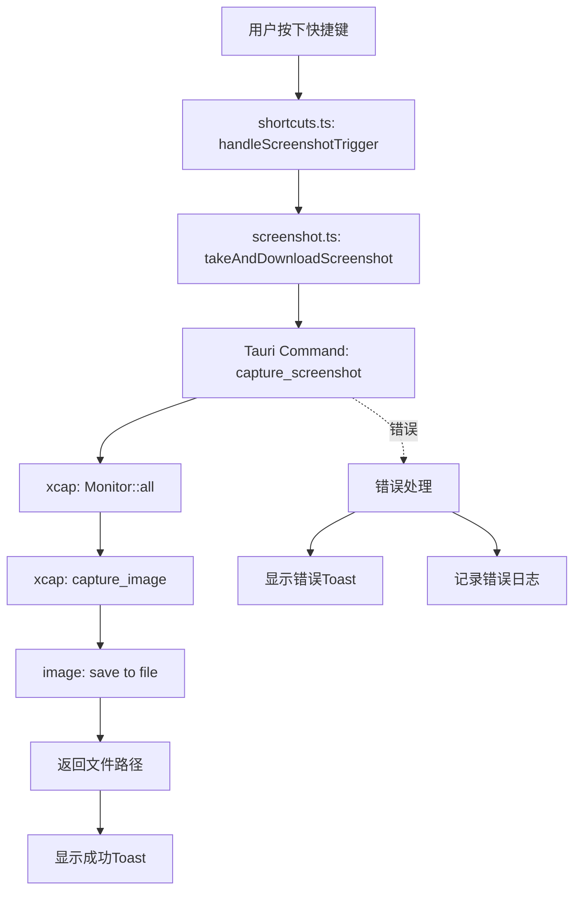
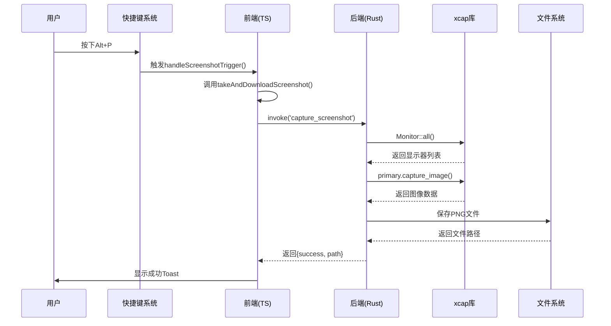
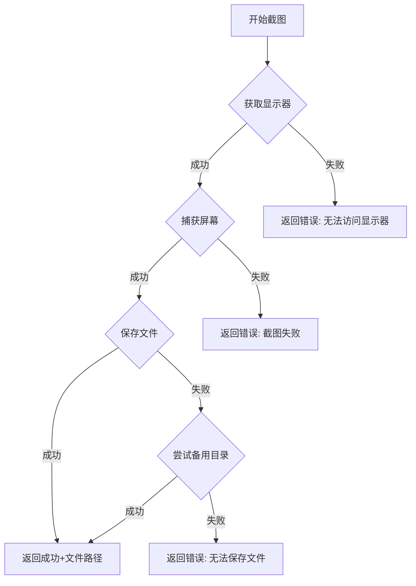

# 系统截图功能技术设计

## 设计概述

### 架构方案
采用Tauri命令模式,在Rust后端使用xcap库实现原生屏幕捕获,通过Tauri IPC与TypeScript前端通信。保持前端接口不变,仅替换底层实现,确保向后兼容性。

### 技术栈
- **后端**: Rust + xcap + image + base64
- **前端**: TypeScript + Tauri API
- **通信**: Tauri命令系统
- **存储**: 文件系统(下载文件夹)

### 设计原则
1. **最小侵入**: 保持现有接口和用户体验不变
2. **渐进迁移**: 先添加新功能,测试通过后再移除旧代码
3. **错误优先**: 完善的错误处理和用户反馈
4. **跨平台**: 统一的API,平台特定的实现细节

## 系统架构

### 组件关系图



### 数据流图



## 技术实现

### 后端实现 (Rust)

#### 1. 依赖配置

**文件**: `src-tauri/Cargo.toml`

```toml
[dependencies]
tauri = { version = "2", features = [] }
tauri-plugin-opener = "2"
tauri-plugin-store = "2.4.0"
tauri-plugin-global-shortcut = "2.3.0"
serde = { version = "1", features = ["derive"] }
serde_json = "1"

# 新增依赖
xcap = "0.7"
image = "0.25"
chrono = "0.4"
```

**说明**:
- `xcap`: 核心屏幕捕获库
- `image`: 图像处理和保存(xcap的依赖,显式声明以确保版本)
- `chrono`: 生成时间戳用于文件命名

#### 2. Tauri命令实现

**文件**: `src-tauri/src/lib.rs`

```rust
use tauri::Manager;
use xcap::Monitor;
use chrono::Local;
use std::path::PathBuf;
use serde::{Serialize, Deserialize};

#[derive(Debug, Serialize, Deserialize)]
struct ScreenshotResult {
    success: bool,
    path: Option<String>,
    error: Option<String>,
}

#[tauri::command]
fn capture_screenshot() -> Result<ScreenshotResult, String> {
    // 获取所有显示器
    let monitors = Monitor::all()
        .map_err(|e| format!("Failed to get monitors: {}", e))?;
    
    // 获取主显示器
    let primary_monitor = monitors
        .into_iter()
        .find(|m| m.is_primary().unwrap_or(false))
        .ok_or_else(|| "No primary monitor found".to_string())?;
    
    // 捕获屏幕
    let image = primary_monitor
        .capture_image()
        .map_err(|e| format!("Failed to capture screen: {}", e))?;
    
    // 生成文件名(带时间戳)
    let timestamp = Local::now().format("%Y%m%d_%H%M%S").to_string();
    let filename = format!("screenshot_{}.png", timestamp);
    
    // 获取下载文件夹路径
    let download_dir = get_download_dir()
        .ok_or_else(|| "Failed to get download directory".to_string())?;
    
    let file_path = download_dir.join(&filename);
    
    // 保存图像
    image.save(&file_path)
        .map_err(|e| format!("Failed to save screenshot: {}", e))?;
    
    Ok(ScreenshotResult {
        success: true,
        path: Some(file_path.to_string_lossy().to_string()),
        error: None,
    })
}

/// 获取下载文件夹路径(跨平台)
fn get_download_dir() -> Option<PathBuf> {
    #[cfg(target_os = "windows")]
    {
        dirs::download_dir()
    }
    
    #[cfg(target_os = "macos")]
    {
        dirs::download_dir()
    }
    
    #[cfg(target_os = "linux")]
    {
        dirs::download_dir()
    }
}

#[cfg_attr(mobile, tauri::mobile_entry_point)]
pub fn run() {
    tauri::Builder::default()
        .plugin(tauri_plugin_store::Builder::new().build())
        .plugin(tauri_plugin_opener::init())
        .plugin(tauri_plugin_global_shortcut::Builder::new().build())
        .invoke_handler(tauri::generate_handler![
            greet,
            capture_screenshot  // 新增命令
        ])
        .run(tauri::generate_context!())
        .expect("error while running tauri application");
}
```

**需要额外添加的依赖**:
```toml
dirs = "5.0"  # 用于获取系统目录
```

### 前端实现 (TypeScript)

#### 1. 更新截图模块

**文件**: `src/lib/screenshot.ts`

```typescript
import { invoke } from '@tauri-apps/api/core'

/**
 * Screenshot options
 */
export interface ScreenshotOptions {
  filename?: string
}

/**
 * Screenshot result from Rust backend
 */
interface ScreenshotBackendResult {
  success: boolean
  path?: string
  error?: string
}

/**
 * Screenshot result for frontend
 */
export interface ScreenshotResult {
  success: boolean
  path?: string
  error?: string
}

/**
 * Take a screenshot using native screen capture (xcap)
 */
export async function takeScreenshot(
  options: ScreenshotOptions = {}
): Promise<ScreenshotResult> {
  try {
    const result = await invoke<ScreenshotBackendResult>('capture_screenshot')
    
    if (!result.success) {
      throw new Error(result.error || 'Screenshot failed')
    }
    
    return {
      success: true,
      path: result.path
    }
  } catch (error) {
    console.error('Screenshot failed:', error)
    return {
      success: false,
      error: error instanceof Error ? error.message : 'Unknown error'
    }
  }
}

/**
 * Take screenshot and show notification
 */
export async function takeAndDownloadScreenshot(
  options: ScreenshotOptions = {}
): Promise<void> {
  const result = await takeScreenshot(options)
  
  if (!result.success) {
    throw new Error(result.error || 'Screenshot failed')
  }
  
  console.log('Screenshot saved to:', result.path)
}

/**
 * Check if screenshot functionality is available
 */
export function isScreenshotSupported(): boolean {
  // xcap is always available in Tauri environment
  return true
}

/**
 * Get screenshot capabilities
 */
export function getScreenshotCapabilities() {
  return {
    supported: true,
    formats: ['png'] as const,
    nativeCapture: true
  }
}
```

#### 2. 快捷键处理器保持不变

**文件**: `src/lib/shortcuts.ts`

现有的`handleScreenshotTrigger`函数无需修改,因为它调用的`takeAndDownloadScreenshot`接口保持不变:

```typescript
function handleScreenshotTrigger() {
  console.log('Screenshot shortcut triggered')

  // Import screenshot function dynamically to avoid circular dependencies
  import('@/lib/screenshot').then(({ takeAndDownloadScreenshot }) => {
    takeAndDownloadScreenshot()
      .then(() => {
        console.log('Screenshot taken successfully')
        // Show success notification
        import('sonner').then(({ toast }) => {
          toast.success('截图已保存')  // 中文化
        }).catch(() => {
          console.log('Screenshot saved successfully')
        })
      })
      .catch((error) => {
        console.error('Screenshot failed:', error)
        // Show error notification
        import('sonner').then(({ toast }) => {
          toast.error('截图失败')  // 中文化
        }).catch(() => {
          console.error('Screenshot failed')
        })
      })
  }).catch((error) => {
    console.error('Failed to load screenshot module:', error)
  })
}
```

## 错误处理策略

### 错误分类

| 错误类型 | 原因 | 处理方式 |
|---------|------|---------|
| 显示器获取失败 | 系统API错误 | 返回错误,显示"无法访问显示器"提示 |
| 权限不足 | macOS屏幕录制权限未授予 | 返回错误,提示用户授予权限 |
| 捕获失败 | xcap内部错误 | 返回错误,记录详细日志 |
| 文件保存失败 | 磁盘空间不足/权限问题 | 返回错误,提示检查磁盘空间和权限 |
| 下载目录不存在 | 系统配置异常 | 尝试备用目录(桌面),仍失败则报错 |

### 错误处理流程



## 平台特定实现

### Windows
- 使用`dirs::download_dir()`获取下载文件夹
- 路径格式: `C:\Users\{username}\Downloads\`
- 无需特殊权限

### macOS
- 使用`dirs::download_dir()`获取下载文件夹
- 路径格式: `/Users/{username}/Downloads/`
- **首次使用需要授予屏幕录制权限**
- 权限路径: 系统偏好设置 > 安全性与隐私 > 屏幕录制

### Linux (X11)
- 使用`dirs::download_dir()`获取下载文件夹
- 路径格式: `/home/{username}/Downloads/`
- 需要安装系统依赖(构建时)

### Linux (Wayland)
- **有限支持**: xcap在Wayland下支持不完整
- 检测方式: 检查`WAYLAND_DISPLAY`环境变量
- 处理策略: 显示警告信息,建议使用X11会话

## 性能优化

### 优化措施
1. **异步执行**: 截图操作在Rust后端异步执行,不阻塞UI
2. **内存管理**: 图像数据在保存后立即释放
3. **文件格式**: 使用PNG格式,平衡质量和文件大小
4. **错误快速返回**: 在每个步骤尽早检测错误并返回

### 性能指标
- 截图捕获: < 200ms
- 文件保存: < 300ms
- 总耗时: < 500ms (目标 < 1s)

## 安全考虑

### 安全措施
1. **路径验证**: 确保文件只保存到安全的系统目录
2. **权限检查**: 在保存前检查目录写入权限
3. **文件名清理**: 使用时间戳生成文件名,避免路径注入
4. **错误信息**: 不在错误消息中暴露敏感系统信息

### 隐私保护
- 截图由用户主动触发
- 文件保存到用户可控的本地目录
- 不进行任何网络传输
- 不收集或上传截图内容

## 测试策略

### 单元测试
- Rust命令的单元测试(模拟xcap调用)
- TypeScript函数的单元测试

### 集成测试
- 端到端截图流程测试
- 错误处理路径测试
- 跨平台兼容性测试

### 手动测试清单
- [ ] Windows 10/11 截图功能
- [ ] macOS 12+ 截图功能(含权限测试)
- [ ] Linux (Ubuntu 20.04+) X11 截图功能
- [ ] 快捷键触发测试
- [ ] 错误场景测试(权限不足、磁盘满等)
- [ ] 性能测试(连续截图)
- [ ] 多显示器环境测试

## 迁移计划

### 阶段1: 添加新功能 (不移除旧代码)
1. 添加xcap依赖
2. 实现Rust命令
3. 更新TypeScript模块(保留html2canvas代码)
4. 测试新功能

### 阶段2: 切换到新实现
1. 修改快捷键处理器调用新函数
2. 全面测试
3. 修复发现的问题

### 阶段3: 清理旧代码
1. 移除html2canvas相关代码
2. 移除html2canvas依赖
3. 更新文档
4. 最终测试

## 回滚策略

如果xcap实现出现严重问题:
1. 恢复快捷键处理器调用html2canvas版本
2. 保留xcap代码但不使用
3. 记录问题并计划修复
4. 在修复后重新切换

## 文档更新

需要更新的文档:
- README.md: 添加系统依赖说明(Linux)
- TAURI_DEBUG_GUIDE.md: 更新截图调试说明
- 用户手册: 添加macOS权限授予指南

## 依赖关系

### 新增Rust依赖
- xcap = "0.7"
- image = "0.25"
- chrono = "0.4"
- dirs = "5.0"

### 移除前端依赖
- html2canvas (在迁移完成后)

### 系统依赖 (Linux)
- libxcb-dev
- libxrandr-dev
- libdbus-1-dev
- libpipewire-0.3-dev
- libwayland-dev
- libegl-dev

