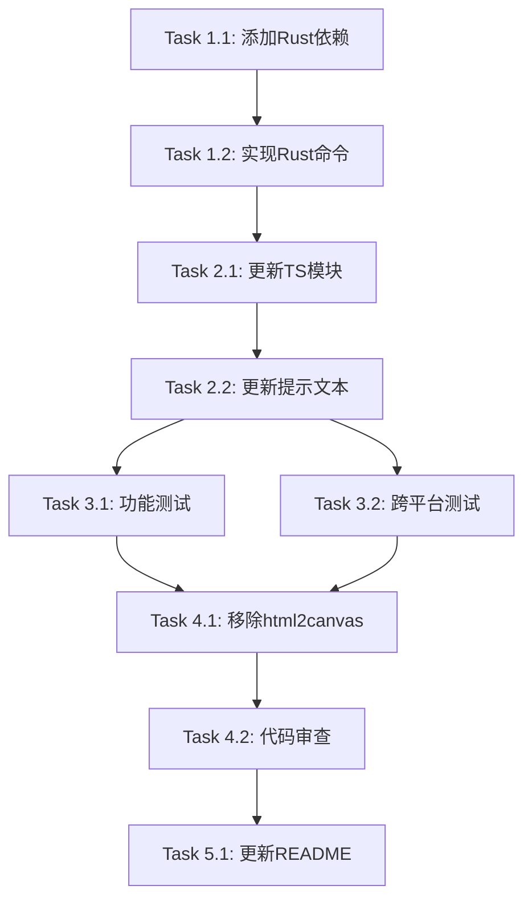

# 系统截图功能 - 任务分解

## 任务概述

本文档将系统截图功能的实现分解为可执行的原子任务。每个任务都是独立的工作单元,包含明确的输入、输出和验收标准。

## 任务列表

### 阶段1: 后端基础设施

- [x] **Task 1.1: 添加Rust依赖**
  - **文件**: `src-tauri/Cargo.toml`
  - **需求**: FR-001, FR-005, NFR-005
  - **描述**: 在Cargo.toml中添加xcap、image、chrono和dirs依赖
  
  _Prompt: 实现spec system-screenshot的任务,首先运行spec-workflow-guide获取工作流程指南然后实现任务:
  
  **Role**: Rust依赖管理专家,负责配置项目依赖
  
  **Task**: 在`src-tauri/Cargo.toml`的`[dependencies]`部分添加以下依赖:
  - xcap = "0.7"
  - image = "0.25"
  - chrono = "0.4"
  - dirs = "5.0"
  
  使用cargo命令添加依赖,不要手动编辑文件。
  
  **Restrictions**: 
  - 必须使用cargo add命令而非手动编辑
  - 确保版本号正确
  - 不要破坏现有依赖
  
  **_Leverage**: 
  - 现有的Cargo.toml结构
  - cargo add命令
  
  **_Requirements**: FR-001 (原生屏幕截图), FR-005 (跨平台支持), NFR-005 (兼容性要求)
  
  **Success**: 
  - 所有依赖成功添加到Cargo.toml
  - cargo build成功编译
  - 依赖版本符合要求
  
  **Instructions**: 在tasks.md中将此任务标记为进行中[-],完成后标记为完成[x]

- [x] **Task 1.2: 实现Rust截图命令**
  - **文件**: `src-tauri/src/lib.rs`
  - **需求**: FR-001, FR-003, NFR-001, NFR-002
  - **描述**: 实现capture_screenshot Tauri命令,使用xcap捕获主显示器屏幕
  
  _Prompt: 实现spec system-screenshot的任务,首先运行spec-workflow-guide获取工作流程指南然后实现任务:
  
  **Role**: Rust后端开发专家,专注于系统级API集成
  
  **Task**: 在`src-tauri/src/lib.rs`中实现`capture_screenshot`命令:
  1. 定义ScreenshotResult结构体(success, path, error字段)
  2. 实现capture_screenshot函数:
     - 使用Monitor::all()获取显示器列表
     - 找到主显示器(is_primary)
     - 调用capture_image()捕获屏幕
     - 生成带时间戳的文件名(screenshot_YYYYMMDD_HHMMSS.png)
     - 获取下载文件夹路径(使用dirs::download_dir)
     - 保存PNG文件
     - 返回ScreenshotResult
  3. 实现完善的错误处理(每个步骤都要处理错误)
  4. 在invoke_handler中注册命令
  
  参考design.md中的完整代码实现。
  
  **Restrictions**: 
  - 必须处理所有可能的错误情况
  - 文件名必须包含时间戳避免冲突
  - 只捕获主显示器
  - 必须使用PNG格式
  
  **_Leverage**: 
  - design.md中的Rust代码示例
  - 现有的Tauri命令模式(greet命令)
  - xcap库的Monitor和capture_image API
  - dirs库的download_dir函数
  
  **_Requirements**: FR-001 (原生屏幕截图), FR-003 (错误处理), NFR-001 (性能), NFR-002 (可靠性)
  
  **Success**: 
  - capture_screenshot命令成功注册
  - 能够捕获主显示器屏幕
  - 文件成功保存到下载文件夹
  - 所有错误情况都有适当处理
  - 返回正确的ScreenshotResult结构
  
  **Instructions**: 在tasks.md中将此任务标记为进行中[-],完成后标记为完成[x]

### 阶段2: 前端集成

- [x] **Task 2.1: 更新TypeScript截图模块**
  - **文件**: `src/lib/screenshot.ts`
  - **需求**: FR-001, FR-002, FR-003, FR-004
  - **描述**: 重写screenshot.ts,调用Rust后端命令替代html2canvas
  
  _Prompt: 实现spec system-screenshot的任务,首先运行spec-workflow-guide获取工作流程指南然后实现任务:
  
  **Role**: TypeScript前端开发专家,专注于Tauri集成
  
  **Task**: 重写`src/lib/screenshot.ts`模块:
  1. 导入Tauri API: `import { invoke } from '@tauri-apps/api/core'`
  2. 定义接口:
     - ScreenshotOptions (简化版,只保留filename)
     - ScreenshotBackendResult (对应Rust的返回类型)
     - ScreenshotResult (前端使用的结果类型)
  3. 实现takeScreenshot函数:
     - 调用invoke<ScreenshotBackendResult>('capture_screenshot')
     - 处理返回结果
     - 错误处理和日志记录
  4. 实现takeAndDownloadScreenshot函数(保持接口不变)
  5. 更新isScreenshotSupported和getScreenshotCapabilities
  6. 移除所有html2canvas相关代码
  
  参考design.md中的TypeScript代码示例。
  
  **Restrictions**: 
  - takeAndDownloadScreenshot接口必须保持不变(向后兼容)
  - 必须有完善的错误处理
  - 必须记录详细日志
  - 移除所有html2canvas引用
  
  **_Leverage**: 
  - design.md中的TypeScript代码示例
  - Tauri invoke API
  - 现有的错误处理模式
  
  **_Requirements**: FR-001 (原生截图), FR-002 (成功反馈), FR-003 (错误处理), FR-004 (保持快捷键配置)
  
  **Success**: 
  - takeScreenshot成功调用Rust命令
  - takeAndDownloadScreenshot接口保持不变
  - 错误处理完善
  - 无html2canvas引用
  - TypeScript编译无错误
  
  **Instructions**: 在tasks.md中将此任务标记为进行中[-],完成后标记为完成[x]

- [x] **Task 2.2: 更新快捷键处理器的提示文本**
  - **文件**: `src/lib/shortcuts.ts`
  - **需求**: FR-002, FR-003
  - **描述**: 将toast提示文本中文化
  
  _Prompt: 实现spec system-screenshot的任务,首先运行spec-workflow-guide获取工作流程指南然后实现任务:
  
  **Role**: 国际化专家,负责用户界面文本本地化
  
  **Task**: 在`src/lib/shortcuts.ts`的`handleScreenshotTrigger`函数中:
  1. 将成功提示从'Screenshot saved successfully'改为'截图已保存'
  2. 将失败提示从'Screenshot failed'改为'截图失败'
  3. 保持其他逻辑不变
  
  **Restrictions**: 
  - 只修改toast消息文本
  - 不改变函数逻辑
  - 保持console.log为英文(用于调试)
  
  **_Leverage**: 
  - 现有的handleScreenshotTrigger函数
  - sonner toast库
  
  **_Requirements**: FR-002 (成功反馈), FR-003 (错误处理)
  
  **Success**: 
  - 成功提示显示中文"截图已保存"
  - 失败提示显示中文"截图失败"
  - 其他功能不受影响
  
  **Instructions**: 在tasks.md中将此任务标记为进行中[-],完成后标记为完成[x]

### 阶段3: 测试与验证

- [-] **Task 3.1: 功能测试**
  - **文件**: 无(手动测试)
  - **需求**: 所有FR和NFR
  - **描述**: 执行完整的功能测试,验证所有需求(需要用户手动测试)
  
  _Prompt: 实现spec system-screenshot的任务,首先运行spec-workflow-guide获取工作流程指南然后实现任务:
  
  **Role**: QA测试工程师,负责功能验证
  
  **Task**: 执行以下测试场景:
  1. 基本截图功能测试(requirements.md测试场景1)
  2. 自定义快捷键测试(requirements.md测试场景2)
  3. 错误处理测试(requirements.md测试场景3)
  4. 性能测试(requirements.md测试场景5)
  
  对于每个测试场景:
  - 执行测试步骤
  - 验证所有验收标准
  - 记录测试结果
  - 发现问题立即报告
  
  **Restrictions**: 
  - 必须严格按照requirements.md中的测试场景执行
  - 所有验收标准都必须通过
  - 发现问题必须记录详细信息
  
  **_Leverage**: 
  - requirements.md中的验收测试场景
  - 应用的开发者工具
  - 系统文件管理器
  
  **_Requirements**: 所有功能需求和非功能需求
  
  **Success**: 
  - 所有测试场景通过
  - 所有验收标准满足
  - 无严重bug
  - 性能符合要求(<1秒)
  
  **Instructions**: 在tasks.md中将此任务标记为进行中[-],完成后标记为完成[x]

- [-] **Task 3.2: 跨平台测试**
  - **文件**: 无(手动测试)
  - **需求**: FR-005, NFR-005
  - **描述**: 在不同操作系统上测试截图功能(需要用户手动测试)
  
  _Prompt: 实现spec system-screenshot的任务,首先运行spec-workflow-guide获取工作流程指南然后实现任务:
  
  **Role**: 跨平台测试专家,负责多平台兼容性验证
  
  **Task**: 在以下平台上测试截图功能:
  1. Windows 10/11
  2. macOS 12+
  3. Linux (Ubuntu 20.04+ with X11)
  
  对于每个平台:
  - 触发截图(使用快捷键)
  - 验证文件保存到正确的下载文件夹
  - 验证截图质量
  - 验证toast提示正常显示
  - 测试错误场景(如权限问题)
  
  特别注意:
  - macOS: 测试屏幕录制权限授予流程
  - Linux: 验证系统依赖已安装
  
  **Restrictions**: 
  - 必须在真实系统上测试,不能只用虚拟机
  - 必须测试所有目标平台
  - 发现平台特定问题必须详细记录
  
  **_Leverage**: 
  - requirements.md测试场景4
  - 各平台的系统设置
  - 文件管理器
  
  **_Requirements**: FR-005 (跨平台支持), NFR-005 (兼容性要求)
  
  **Success**: 
  - 所有平台上截图功能正常
  - 文件保存到正确位置
  - 截图质量一致
  - 平台特定功能正常(如macOS权限)
  
  **Instructions**: 在tasks.md中将此任务标记为进行中[-],完成后标记为完成[x]

### 阶段4: 清理与优化

- [x] **Task 4.1: 移除html2canvas依赖**
  - **文件**: `package.json`
  - **需求**: NFR-004
  - **描述**: 从package.json中移除html2canvas依赖
  
  _Prompt: 实现spec system-screenshot的任务,首先运行spec-workflow-guide获取工作流程指南然后实现任务:
  
  **Role**: 依赖管理专家,负责清理废弃依赖
  
  **Task**: 移除html2canvas依赖:
  1. 使用npm uninstall html2canvas命令
  2. 验证package.json中已无html2canvas
  3. 验证package-lock.json已更新
  4. 运行npm install确保依赖树正确
  
  **Restrictions**: 
  - 必须使用npm uninstall命令,不要手动编辑
  - 确保不影响其他依赖
  - 验证应用仍能正常构建
  
  **_Leverage**: 
  - npm uninstall命令
  - package.json
  
  **_Requirements**: NFR-004 (可维护性要求)
  
  **Success**: 
  - html2canvas从package.json中移除
  - package-lock.json已更新
  - npm install成功
  - 应用构建成功
  - 应用运行正常
  
  **Instructions**: 在tasks.md中将此任务标记为进行中[-],完成后标记为完成[x]

- [x] **Task 4.2: 代码审查与优化**
  - **文件**: 所有修改的文件
  - **需求**: NFR-001, NFR-004
  - **描述**: 审查所有代码变更,确保质量和性能
  
  _Prompt: 实现spec system-screenshot的任务,首先运行spec-workflow-guide获取工作流程指南然后实现任务:
  
  **Role**: 代码审查专家,负责代码质量保证
  
  **Task**: 审查以下方面:
  1. 代码风格: 符合项目规范
  2. 错误处理: 所有错误都有适当处理
  3. 日志记录: 关键操作都有日志
  4. 性能: 无明显性能问题
  5. 安全: 无安全漏洞
  6. 文档: 代码注释清晰
  
  检查文件:
  - src-tauri/src/lib.rs
  - src/lib/screenshot.ts
  - src/lib/shortcuts.ts
  
  **Restrictions**: 
  - 必须检查所有修改的代码
  - 发现问题必须修复
  - 确保符合项目编码规范
  
  **_Leverage**: 
  - 项目现有代码风格
  - design.md中的最佳实践
  - Rust和TypeScript linter
  
  **_Requirements**: NFR-001 (性能要求), NFR-004 (可维护性要求)
  
  **Success**: 
  - 代码风格一致
  - 错误处理完善
  - 日志记录充分
  - 无性能问题
  - 无安全漏洞
  - 注释清晰
  
  **Instructions**: 在tasks.md中将此任务标记为进行中[-],完成后标记为完成[x]

### 阶段5: 文档更新

- [x] **Task 5.1: 更新README**
  - **文件**: `README.md`
  - **需求**: NFR-004
  - **描述**: 更新README,添加系统依赖说明
  
  _Prompt: 实现spec system-screenshot的任务,首先运行spec-workflow-guide获取工作流程指南然后实现任务:
  
  **Role**: 技术文档编写专家,负责用户文档维护
  
  **Task**: 在README.md中添加:
  1. Linux系统依赖部分:
     - 列出所需的系统库
     - 提供Ubuntu/Debian安装命令
     - 提供其他发行版的说明
  2. macOS权限说明:
     - 说明首次使用需要授予屏幕录制权限
     - 提供权限设置路径
  3. 截图功能说明:
     - 说明使用xcap进行原生屏幕捕获
     - 说明默认快捷键和自定义方法
  
  参考design.md中的系统依赖信息。
  
  **Restrictions**: 
  - 保持README现有结构
  - 使用清晰简洁的语言
  - 提供具体的命令示例
  
  **_Leverage**: 
  - design.md中的依赖信息
  - 现有README结构
  
  **_Requirements**: NFR-004 (可维护性要求)
  
  **Success**: 
  - Linux依赖说明清晰
  - macOS权限说明完整
  - 截图功能说明准确
  - 文档格式正确
  
  **Instructions**: 在tasks.md中将此任务标记为进行中[-],完成后标记为完成[x]

## 任务依赖关系

## 验收标准

所有任务完成后,系统应满足:
- ✅ 截图功能使用xcap实现
- ✅ 快捷键触发正常工作
- ✅ 文件保存到下载文件夹
- ✅ Toast提示正常显示
- ✅ 所有平台测试通过
- ✅ html2canvas已移除
- ✅ 文档已更新
- ✅ 代码质量符合标准

